# Purpose

This README is here to describe my analysis with the accompanying code.

This analysis will look at the dynamic conditional correlations of the
sector returns of the ALSI The time period will start at January 1 2014
and end at the most recent date October 31 2022. The data will then be
subset for the month periods that South Africa experienced loadshedding.
The aim of this paper is to see if there is a difference in sector
dynamics between the Financials, Industrials, Property, and Resources
for the ALSI. The DCC-GARCH model will be used to model the dynamic
correlation structure of these returns during these periods of
loadshedding and allow us to study the impact of loadshedding on the
market.

First we will load necessary packages and source our code files.

``` r
pacman::p_load(modelsummary, gt, knitr, kableExtra, tidyverse, lubridate, tinytex, rmarkdown, crypto2, quantmod, MTS, rmgarch, rugarch, tbl2xts, fmxdat, ggthemes, summarytools, vars, tseries, pander, cowplot, qpcR, tidyquant, stargazer, data.table, xtable)


list.files('code/', full.names = T, recursive = T) %>% as.list() %>% walk(~source(.))
```

Below is the code used to create this file and the Texevier document.

``` r
CHOSEN_LOCATION <- "/Users/svenwellmann/Desktop/Masters Semester 2/Financial Econometrics/FMX_Project/"
fmxdat::make_project(FilePath = glue::glue("{CHOSEN_LOCATION}"), ProjNam = "20850980Project", Mac = TRUE)

Texevier::create_template(directory = glue::glue("{CHOSEN_LOCATION}"), template_name = "Paper")
```

# Get Data

``` r
ALSI <- read_rds("data/Alsi_Returns.rds")

ALSIsel <- ALSI %>% dplyr::select(date, Tickers, Return, J200, Sector)

ALSI_df <- ALSIsel %>% filter(!is.na(J200)) %>% filter(date>= "2014-01-01")

sectors <- ALSI_df %>% pull(Sector) %>% unique()

sector_return <- list()
for(i in 1:length(sectors)){
    # Loop through sectors and calculate returns and cumulative returns
    sector_return[[i]] <- portfolio_return_function_alsi(ALSI_df, sector = sectors[i]) %>% 
      mutate(cumreturn_Rand = (cumprod(1 + Returns))) %>% # Start at 1
      mutate(cumreturn_Rand = cumreturn_Rand/dplyr:::first(cumreturn_Rand)) %>% 
      mutate(Sector = sectors[i])
}

# Rename tibbles
names(sector_return) <- sectors

# Combine Dataframes
sectors_cum_return <- rbind(sector_return[[1]], sector_return[[2]], sector_return[[3]], sector_return[[4]]) %>% arrange(date)
```

Below we look at the different cumulative returns of the ALSI for its
respective sectors. We observe that the Resources have seen the largest
cumulative growth of all sectors. Property have seen minimal cumulative
growth, being largely affected by the Covid-19 Pandemic in 2020.

``` r
sectors_cum_return_plot <- sectors_cum_return %>% 
  ggplot() +
  geom_line(aes(date, cumreturn_Rand, colour = Sector), alpha = 0.8) + 
  #facet_wrap(~Sector) + 
  fmxdat::fmx_cols() + 
  labs(title = "Cumulative Returns per Sector for ALSI", y = "Cumulative Returns", x = "") + 
  fmxdat::theme_fmx(title.size = ggpts(25))
sectors_cum_return_plot
```

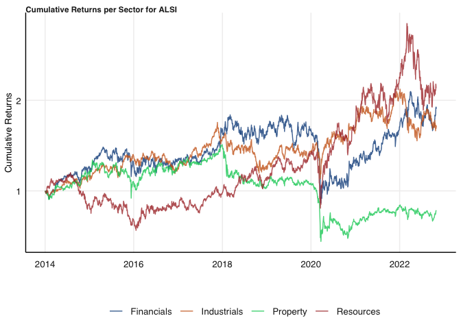

``` r
sectors_cum_return_plot_facet <- sectors_cum_return %>% 
  ggplot() +
  geom_line(aes(date, cumreturn_Rand, colour = Sector), alpha = 0.8) + 
  facet_wrap(~Sector) + 
  fmxdat::fmx_cols() + 
  labs(title = "Cumulative Returns per Sector for ALSI", y = "Cumulative Returns", x = "") + 
  fmxdat::theme_fmx(title.size = ggpts(25))
sectors_cum_return_plot_facet
```

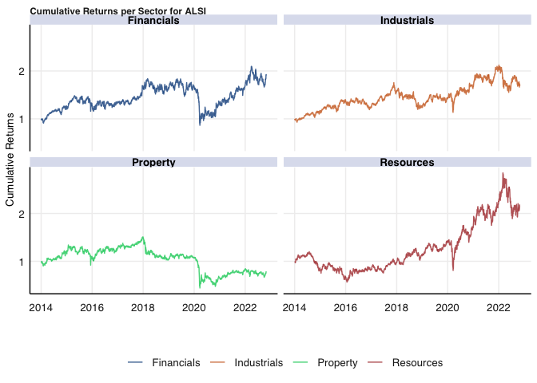

The ALSI sector returns are then stratified into periods of loadshedding
and periods without loadshedding.

I have then used a few sources to identify the periods of loadshedding
in South Africa. I have identified periods:

-   November 2014 - March of 2015
-   February 2019 - March 2019
-   December 2019 - March 2020
-   March 2021 - June 2021
-   October 2021 - November 2021
-   February 2022 - April 2022
-   June 2022 - December 2022

``` r
alsi_loadshed <- rbind(
sectors_cum_return %>% filter(date >= "2014-11-01" & date <= "2015-3-31"),
sectors_cum_return %>% filter(date >= "2019-02-01" & date <= "2019-3-31"),
sectors_cum_return %>% filter(date >= "2019-12-01" & date <= "2020-3-31"),
sectors_cum_return %>% filter(date >= "2021-3-01" & date <= "2021-6-30"),
sectors_cum_return %>% filter(date >= "2021-9-01" & date <= "2021-11-30"),
sectors_cum_return %>% filter(date >= "2022-2-01" & date <= "2022-4-30"),
sectors_cum_return %>% filter(date >= "2022-6-01" & date <= "2022-12-31"))

alsi_no_loadshed <- sectors_cum_return %>% filter(!date %in% (alsi_loadshed %>% pull(date)))

sectors_cum_return_wide <- sectors_cum_return %>% dplyr:::select(date, Returns, Sector) %>% spread(key = "Sector", value = "Returns")
sectors_cum_return_nona <- impute_missing_returns(sectors_cum_return_wide, impute_returns_method = "Drawn_Distribution_Collective")
xts_alsi_return <- sectors_cum_return_nona %>%  tbl_xts() 

alsi_loadshed_wide <- alsi_loadshed %>% dplyr:::select(date, Returns, Sector) %>% spread(key = "Sector", value = "Returns")
alsi_loadshed_nona <- impute_missing_returns(alsi_loadshed_wide, impute_returns_method = "Drawn_Distribution_Collective")
xts_alsi_return_loadshed <- alsi_loadshed_nona %>%  tbl_xts()

alsi_no_loadshed_wide <- alsi_no_loadshed %>% dplyr:::select(date, Returns, Sector) %>% spread(key = "Sector", value = "Returns")
alsi_no_loadshed_nona <- impute_missing_returns(alsi_no_loadshed_wide, impute_returns_method = "Drawn_Distribution_Collective")
xts_alsi_return_no_loadshed <- alsi_no_loadshed_nona %>%  tbl_xts()
```

The Log returns of all sectors across the entire period are the plotted.

``` r
log_returns_plot <- sectors_cum_return %>% mutate(Sector = factor(Sector, levels = c("Financials",  "Industrials", "Property", "Resources"))) %>% 
  ggplot() + geom_line(aes(x = date, y = Returns, colour = Sector, alpha = 1)) + 
facet_wrap(~Sector, scales = "free_y", nrow = 3) + 
guides(alpha = "none") + 
fmxdat::theme_fmx() +
labs(x = "", y = "", subtitle = " ") +
theme(legend.position = "none") +
scale_color_hue(l = 20) + 
scale_x_date(labels = scales::date_format("%Y"), date_breaks = "1 years") + 
theme(axis.text = element_text(size = 7))

log_returns_plot
```

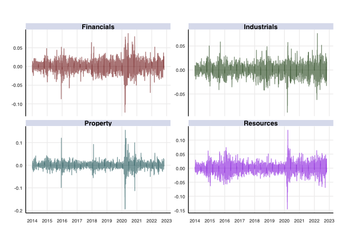

# Fit DCC models

The DCC model is then fit over the whole period, the period of
loadshedding and the period without loadshedding. The gjrGARCH model is
used for this analysis. The residuals of the GARCH model are then used
in the DCC model.

``` r
# Using the rugarch package, let's specify our own univariate
# functions to be used in the dcc process:

# Step 1: Give the specifications to be used first:

# A) Univariate GARCH specifications:
uspec <- ugarchspec(variance.model = list(model = "gjrGARCH", garchOrder = c(1, 1)), mean.model = list(armaOrder = c(1, 0), include.mean = TRUE), distribution.model = "sstd")
# B) Repeat uspec n times. This specification should be
# self-explanatory...
multi_univ_garch_spec <- multispec(replicate(ncol(xts_alsi_return), uspec))
multi_univ_garch_spec_ls <- multispec(replicate(ncol(xts_alsi_return_loadshed), uspec))
multi_univ_garch_spec_nls <- multispec(replicate(ncol(xts_alsi_return_no_loadshed), uspec))

# Right, so now every series will have a GJR Garch univariate
# specification. (see ?ugarchspec for other options...)

# C) DCC Specs
spec.dcc = dccspec(multi_univ_garch_spec, dccOrder = c(1, 1), distribution = "mvnorm", lag.criterion = c("AIC", "HQ", "SC", "FPE")[1], model = c("DCC", "aDCC")[1])
spec.dcc_ls = dccspec(multi_univ_garch_spec_ls, dccOrder = c(1, 1), distribution = "mvnorm", lag.criterion = c("AIC", "HQ", "SC", "FPE")[1], model = c("DCC", "aDCC")[1])
spec.dcc_nls = dccspec(multi_univ_garch_spec_nls, dccOrder = c(1, 1), distribution = "mvnorm", lag.criterion = c("AIC", "HQ", "SC", "FPE")[1], model = c("DCC", "aDCC")[1])

# D) Enable clustering for speed:
cl = makePSOCKcluster(10)

# ------------------------ Step 2: The specs are now saved.
# Let's now build our DCC models...  ------------------------

# First, fit the univariate series for each column:
multf = multifit(multi_univ_garch_spec, xts_alsi_return, cluster = cl)
multf_ls = multifit(multi_univ_garch_spec_ls, xts_alsi_return_loadshed, cluster = cl)
multf_nls = multifit(multi_univ_garch_spec_nls, xts_alsi_return_no_loadshed, cluster = cl)

# Now we can use multf to estimate the dcc model using our
# dcc.spec:
#fit.dcc = dccfit(spec.dcc, data = xts_alsi_return, solver = "gosolnp", cluster = cl, fit.control = list(eval.se = TRUE), fit = multf)
#fit.dcc_ls = dccfit(spec.dcc_ls, data = xts_alsi_return_loadshed, solver = "gosolnp", cluster = cl, fit.control = list(eval.se = TRUE), fit = multf_ls)
#fit.dcc_nls = dccfit(spec.dcc_nls, data = xts_alsi_return_no_loadshed, solver = "gosolnp", cluster = cl, fit.control = list(eval.se = TRUE), fit = multf_nls)

#saveRDS(fit.dcc, file = "fit.dcc.rds")
#saveRDS(fit.dcc_ls, file = "fit.dcc_ls.rds")
#saveRDS(fit.dcc_nls, file = "fit.dcc_nls.rds")

# I have saved and read in the files to help save knitting time

fit.dcc = readRDS(file = "fit.dcc.rds")
fit.dcc_ls = readRDS(file = "fit.dcc_ls.rds")
fit.dcc_nls = readRDS(file = "fit.dcc_nls.rds")

# And that is our DCC fitted model!

# We can now test the model's fit as follows: Let's use the
# covariance matrices to test the adequacy of MV model in
# fitting mean residual processes:
RcovList <- rcov(fit.dcc)  # This is now a list of the monthly covariances of our DCC model series.
RcovList_ls <- rcov(fit.dcc_ls)
RcovList_nls <- rcov(fit.dcc_nls)

covmat = matrix(RcovList, nrow(xts_alsi_return), ncol(xts_alsi_return) * ncol(xts_alsi_return), byrow = TRUE)
covmat_ls = matrix(RcovList, nrow(xts_alsi_return_loadshed), ncol(xts_alsi_return_loadshed) * ncol(xts_alsi_return_loadshed), byrow = TRUE)
covmat_nls = matrix(RcovList, nrow(xts_alsi_return_no_loadshed), ncol(xts_alsi_return_no_loadshed) * ncol(xts_alsi_return_no_loadshed), byrow = TRUE)

mc1 = MCHdiag(xts_alsi_return, covmat)
```

    ## Test results:  
    ## Q(m) of et: 
    ## Test and p-value:  14.89435 0.1359615 
    ## Rank-based test: 
    ## Test and p-value:  20.32171 0.0263526 
    ## Qk(m) of epsilon_t: 
    ## Test and p-value:  200.5399 0.0163601 
    ## Robust Qk(m):  
    ## Test and p-value:  191.6377 0.04451205

``` r
mc1_ls = MCHdiag(xts_alsi_return_loadshed, covmat_ls)
```

    ## Test results:  
    ## Q(m) of et: 
    ## Test and p-value:  988.6095 0 
    ## Rank-based test: 
    ## Test and p-value:  174.7134 0 
    ## Qk(m) of epsilon_t: 
    ## Test and p-value:  2681.109 0 
    ## Robust Qk(m):  
    ## Test and p-value:  203.5634 0.0112939

``` r
mc1_nls = MCHdiag(xts_alsi_return_no_loadshed, covmat_nls)
```

    ## Test results:  
    ## Q(m) of et: 
    ## Test and p-value:  808.781 0 
    ## Rank-based test: 
    ## Test and p-value:  1220.184 0 
    ## Qk(m) of epsilon_t: 
    ## Test and p-value:  1345.996 0 
    ## Robust Qk(m):  
    ## Test and p-value:  993.9943 0

The results have to be pulled out of the data using the following code.
This will also rename our dynamic conditional correlations.

``` r
dcc.time.var.cor <- rcor(fit.dcc)
dcc.time.var.cor_ls <- rcor(fit.dcc_ls)
dcc.time.var.cor_nls <- rcor(fit.dcc_nls)

dcc.time.var.cor <- aperm(dcc.time.var.cor, c(3, 2, 1))
dcc.time.var.cor_ls <- aperm(dcc.time.var.cor_ls, c(3, 2, 1))
dcc.time.var.cor_nls <- aperm(dcc.time.var.cor_nls, c(3, 2, 1))

dim(dcc.time.var.cor) <- c(nrow(dcc.time.var.cor), ncol(dcc.time.var.cor)^2)
dim(dcc.time.var.cor_ls) <- c(nrow(dcc.time.var.cor_ls), ncol(dcc.time.var.cor_ls)^2)
dim(dcc.time.var.cor_nls) <- c(nrow(dcc.time.var.cor_nls), ncol(dcc.time.var.cor_nls)^2)

dcc.time.var.cor <- renamingdcc(ReturnSeries = xts_alsi_return, DCC.TV.Cor = dcc.time.var.cor)
```

    ## Warning: `tbl_df()` was deprecated in dplyr 1.0.0.
    ## ℹ Please use `tibble::as_tibble()` instead.

``` r
dcc.time.var.cor_ls <- renamingdcc(ReturnSeries = xts_alsi_return_loadshed, DCC.TV.Cor = dcc.time.var.cor_ls)
dcc.time.var.cor_nls <- renamingdcc(ReturnSeries = xts_alsi_return_no_loadshed, DCC.TV.Cor = dcc.time.var.cor_nls)
```

## Statistics

First we assess the fit of the DCC model on the data.

``` r
star_fit.dcc <- round(fit.dcc@mfit$matcoef[rownames(fit.dcc@mfit$matcoef) %like% 'omega|alpha1|beta1|dcca1|dccb1',, drop = FALSE], 4) #%>% data.frame()

star_fit.dcc %>% kable()%>% kable_styling() %>% 
  add_footnote("Note: This table displays the fit of the dynamic conditional correlations of daily returns of different sectors within the ALSI over the full period of this study.", notation="none")
```

<table class="table" style="margin-left: auto; margin-right: auto;">
<thead>
<tr>
<th style="text-align:left;">
</th>
<th style="text-align:right;">
Estimate
</th>
<th style="text-align:right;">
Std. Error
</th>
<th style="text-align:right;">
t value
</th>
<th style="text-align:right;">
Pr(\>\|t\|)
</th>
</tr>
</thead>
<tbody>
<tr>
<td style="text-align:left;">
\[Financials\].omega
</td>
<td style="text-align:right;">
0.0000
</td>
<td style="text-align:right;">
0.0000
</td>
<td style="text-align:right;">
0.6434
</td>
<td style="text-align:right;">
0.5199
</td>
</tr>
<tr>
<td style="text-align:left;">
\[Financials\].alpha1
</td>
<td style="text-align:right;">
0.0241
</td>
<td style="text-align:right;">
0.0248
</td>
<td style="text-align:right;">
0.9719
</td>
<td style="text-align:right;">
0.3311
</td>
</tr>
<tr>
<td style="text-align:left;">
\[Financials\].beta1
</td>
<td style="text-align:right;">
0.9176
</td>
<td style="text-align:right;">
0.0471
</td>
<td style="text-align:right;">
19.4922
</td>
<td style="text-align:right;">
0.0000
</td>
</tr>
<tr>
<td style="text-align:left;">
\[Industrials\].omega
</td>
<td style="text-align:right;">
0.0000
</td>
<td style="text-align:right;">
0.0000
</td>
<td style="text-align:right;">
5.3197
</td>
<td style="text-align:right;">
0.0000
</td>
</tr>
<tr>
<td style="text-align:left;">
\[Industrials\].alpha1
</td>
<td style="text-align:right;">
0.0057
</td>
<td style="text-align:right;">
0.0071
</td>
<td style="text-align:right;">
0.8065
</td>
<td style="text-align:right;">
0.4199
</td>
</tr>
<tr>
<td style="text-align:left;">
\[Industrials\].beta1
</td>
<td style="text-align:right;">
0.9017
</td>
<td style="text-align:right;">
0.0092
</td>
<td style="text-align:right;">
98.1795
</td>
<td style="text-align:right;">
0.0000
</td>
</tr>
<tr>
<td style="text-align:left;">
\[Property\].omega
</td>
<td style="text-align:right;">
0.0000
</td>
<td style="text-align:right;">
0.0000
</td>
<td style="text-align:right;">
0.6647
</td>
<td style="text-align:right;">
0.5062
</td>
</tr>
<tr>
<td style="text-align:left;">
\[Property\].alpha1
</td>
<td style="text-align:right;">
0.0374
</td>
<td style="text-align:right;">
0.0397
</td>
<td style="text-align:right;">
0.9403
</td>
<td style="text-align:right;">
0.3471
</td>
</tr>
<tr>
<td style="text-align:left;">
\[Property\].beta1
</td>
<td style="text-align:right;">
0.8854
</td>
<td style="text-align:right;">
0.0178
</td>
<td style="text-align:right;">
49.6809
</td>
<td style="text-align:right;">
0.0000
</td>
</tr>
<tr>
<td style="text-align:left;">
\[Resources\].omega
</td>
<td style="text-align:right;">
0.0000
</td>
<td style="text-align:right;">
0.0000
</td>
<td style="text-align:right;">
0.3505
</td>
<td style="text-align:right;">
0.7260
</td>
</tr>
<tr>
<td style="text-align:left;">
\[Resources\].alpha1
</td>
<td style="text-align:right;">
0.0169
</td>
<td style="text-align:right;">
0.0301
</td>
<td style="text-align:right;">
0.5623
</td>
<td style="text-align:right;">
0.5739
</td>
</tr>
<tr>
<td style="text-align:left;">
\[Resources\].beta1
</td>
<td style="text-align:right;">
0.9444
</td>
<td style="text-align:right;">
0.0479
</td>
<td style="text-align:right;">
19.7292
</td>
<td style="text-align:right;">
0.0000
</td>
</tr>
<tr>
<td style="text-align:left;">
\[Joint\]dcca1
</td>
<td style="text-align:right;">
0.0266
</td>
<td style="text-align:right;">
0.0047
</td>
<td style="text-align:right;">
5.6699
</td>
<td style="text-align:right;">
0.0000
</td>
</tr>
<tr>
<td style="text-align:left;">
\[Joint\]dccb1
</td>
<td style="text-align:right;">
0.9515
</td>
<td style="text-align:right;">
0.0090
</td>
<td style="text-align:right;">
105.1736
</td>
<td style="text-align:right;">
0.0000
</td>
</tr>
</tbody>
<tfoot>
<tr>
<td style="padding: 0; border:0;" colspan="100%">
<sup></sup> Note: This table displays the fit of the dynamic conditional
correlations of daily returns of different sectors within the ALSI over
the full period of this study.
</td>
</tr>
</tfoot>
</table>

``` r
star_fit.dcc_ls <- round(fit.dcc_ls@mfit$matcoef[rownames(fit.dcc_ls@mfit$matcoef) %like% 'omega|alpha1|beta1|dcca1|dccb1',, drop = FALSE],4)

star_fit.dcc_ls %>% kable()%>% kable_styling() %>% 
  add_footnote("Note: This table displays the fit of the dynamic conditional correlations of daily returns of different sectors within the ALSI over the periods that encounter loadshedding in this study.", notation="none")
```

<table class="table" style="margin-left: auto; margin-right: auto;">
<thead>
<tr>
<th style="text-align:left;">
</th>
<th style="text-align:right;">
Estimate
</th>
<th style="text-align:right;">
Std. Error
</th>
<th style="text-align:right;">
t value
</th>
<th style="text-align:right;">
Pr(\>\|t\|)
</th>
</tr>
</thead>
<tbody>
<tr>
<td style="text-align:left;">
\[Financials\].omega
</td>
<td style="text-align:right;">
0.0000
</td>
<td style="text-align:right;">
0.0000
</td>
<td style="text-align:right;">
2.6464
</td>
<td style="text-align:right;">
0.0081
</td>
</tr>
<tr>
<td style="text-align:left;">
\[Financials\].alpha1
</td>
<td style="text-align:right;">
0.0000
</td>
<td style="text-align:right;">
0.0758
</td>
<td style="text-align:right;">
0.0000
</td>
<td style="text-align:right;">
1.0000
</td>
</tr>
<tr>
<td style="text-align:left;">
\[Financials\].beta1
</td>
<td style="text-align:right;">
0.7239
</td>
<td style="text-align:right;">
0.0818
</td>
<td style="text-align:right;">
8.8533
</td>
<td style="text-align:right;">
0.0000
</td>
</tr>
<tr>
<td style="text-align:left;">
\[Industrials\].omega
</td>
<td style="text-align:right;">
0.0000
</td>
<td style="text-align:right;">
0.0000
</td>
<td style="text-align:right;">
18.2457
</td>
<td style="text-align:right;">
0.0000
</td>
</tr>
<tr>
<td style="text-align:left;">
\[Industrials\].alpha1
</td>
<td style="text-align:right;">
0.0000
</td>
<td style="text-align:right;">
0.0143
</td>
<td style="text-align:right;">
0.0000
</td>
<td style="text-align:right;">
1.0000
</td>
</tr>
<tr>
<td style="text-align:left;">
\[Industrials\].beta1
</td>
<td style="text-align:right;">
0.8280
</td>
<td style="text-align:right;">
0.0183
</td>
<td style="text-align:right;">
45.1670
</td>
<td style="text-align:right;">
0.0000
</td>
</tr>
<tr>
<td style="text-align:left;">
\[Property\].omega
</td>
<td style="text-align:right;">
0.0001
</td>
<td style="text-align:right;">
0.0000
</td>
<td style="text-align:right;">
3.1694
</td>
<td style="text-align:right;">
0.0015
</td>
</tr>
<tr>
<td style="text-align:left;">
\[Property\].alpha1
</td>
<td style="text-align:right;">
0.0687
</td>
<td style="text-align:right;">
0.0954
</td>
<td style="text-align:right;">
0.7200
</td>
<td style="text-align:right;">
0.4716
</td>
</tr>
<tr>
<td style="text-align:left;">
\[Property\].beta1
</td>
<td style="text-align:right;">
0.5314
</td>
<td style="text-align:right;">
0.1099
</td>
<td style="text-align:right;">
4.8351
</td>
<td style="text-align:right;">
0.0000
</td>
</tr>
<tr>
<td style="text-align:left;">
\[Resources\].omega
</td>
<td style="text-align:right;">
0.0000
</td>
<td style="text-align:right;">
0.0000
</td>
<td style="text-align:right;">
2.5240
</td>
<td style="text-align:right;">
0.0116
</td>
</tr>
<tr>
<td style="text-align:left;">
\[Resources\].alpha1
</td>
<td style="text-align:right;">
0.0000
</td>
<td style="text-align:right;">
0.0279
</td>
<td style="text-align:right;">
0.0000
</td>
<td style="text-align:right;">
1.0000
</td>
</tr>
<tr>
<td style="text-align:left;">
\[Resources\].beta1
</td>
<td style="text-align:right;">
0.7978
</td>
<td style="text-align:right;">
0.0585
</td>
<td style="text-align:right;">
13.6449
</td>
<td style="text-align:right;">
0.0000
</td>
</tr>
<tr>
<td style="text-align:left;">
\[Joint\]dcca1
</td>
<td style="text-align:right;">
0.0247
</td>
<td style="text-align:right;">
0.0102
</td>
<td style="text-align:right;">
2.4348
</td>
<td style="text-align:right;">
0.0149
</td>
</tr>
<tr>
<td style="text-align:left;">
\[Joint\]dccb1
</td>
<td style="text-align:right;">
0.9275
</td>
<td style="text-align:right;">
0.0314
</td>
<td style="text-align:right;">
29.5384
</td>
<td style="text-align:right;">
0.0000
</td>
</tr>
</tbody>
<tfoot>
<tr>
<td style="padding: 0; border:0;" colspan="100%">
<sup></sup> Note: This table displays the fit of the dynamic conditional
correlations of daily returns of different sectors within the ALSI over
the periods that encounter loadshedding in this study.
</td>
</tr>
</tfoot>
</table>

``` r
star_fit.dcc_nls <- round(fit.dcc_nls@mfit$matcoef[rownames(fit.dcc_nls@mfit$matcoef) %like% 'omega|alpha1|beta1|dcca1|dccb1',, drop = FALSE],4)

star_fit.dcc_nls %>% kable()%>% kable_styling() %>% 
  add_footnote("Note: This table displays the fit of the dynamic conditional correlations of daily returns of different sectors within the ALSI over the periods that do not encounter loadshedding in this study.", notation="none")
```

<table class="table" style="margin-left: auto; margin-right: auto;">
<thead>
<tr>
<th style="text-align:left;">
</th>
<th style="text-align:right;">
Estimate
</th>
<th style="text-align:right;">
Std. Error
</th>
<th style="text-align:right;">
t value
</th>
<th style="text-align:right;">
Pr(\>\|t\|)
</th>
</tr>
</thead>
<tbody>
<tr>
<td style="text-align:left;">
\[Financials\].omega
</td>
<td style="text-align:right;">
0.0000
</td>
<td style="text-align:right;">
0.0000
</td>
<td style="text-align:right;">
0.5307
</td>
<td style="text-align:right;">
0.5956
</td>
</tr>
<tr>
<td style="text-align:left;">
\[Financials\].alpha1
</td>
<td style="text-align:right;">
0.0308
</td>
<td style="text-align:right;">
0.0202
</td>
<td style="text-align:right;">
1.5247
</td>
<td style="text-align:right;">
0.1273
</td>
</tr>
<tr>
<td style="text-align:left;">
\[Financials\].beta1
</td>
<td style="text-align:right;">
0.9319
</td>
<td style="text-align:right;">
0.0296
</td>
<td style="text-align:right;">
31.4997
</td>
<td style="text-align:right;">
0.0000
</td>
</tr>
<tr>
<td style="text-align:left;">
\[Industrials\].omega
</td>
<td style="text-align:right;">
0.0000
</td>
<td style="text-align:right;">
0.0000
</td>
<td style="text-align:right;">
0.1620
</td>
<td style="text-align:right;">
0.8713
</td>
</tr>
<tr>
<td style="text-align:left;">
\[Industrials\].alpha1
</td>
<td style="text-align:right;">
0.0203
</td>
<td style="text-align:right;">
0.0968
</td>
<td style="text-align:right;">
0.2099
</td>
<td style="text-align:right;">
0.8337
</td>
</tr>
<tr>
<td style="text-align:left;">
\[Industrials\].beta1
</td>
<td style="text-align:right;">
0.9021
</td>
<td style="text-align:right;">
0.0823
</td>
<td style="text-align:right;">
10.9579
</td>
<td style="text-align:right;">
0.0000
</td>
</tr>
<tr>
<td style="text-align:left;">
\[Property\].omega
</td>
<td style="text-align:right;">
0.0000
</td>
<td style="text-align:right;">
0.0000
</td>
<td style="text-align:right;">
0.4572
</td>
<td style="text-align:right;">
0.6475
</td>
</tr>
<tr>
<td style="text-align:left;">
\[Property\].alpha1
</td>
<td style="text-align:right;">
0.0594
</td>
<td style="text-align:right;">
0.0502
</td>
<td style="text-align:right;">
1.1813
</td>
<td style="text-align:right;">
0.2375
</td>
</tr>
<tr>
<td style="text-align:left;">
\[Property\].beta1
</td>
<td style="text-align:right;">
0.8878
</td>
<td style="text-align:right;">
0.0279
</td>
<td style="text-align:right;">
31.7715
</td>
<td style="text-align:right;">
0.0000
</td>
</tr>
<tr>
<td style="text-align:left;">
\[Resources\].omega
</td>
<td style="text-align:right;">
0.0000
</td>
<td style="text-align:right;">
0.0000
</td>
<td style="text-align:right;">
0.4453
</td>
<td style="text-align:right;">
0.6561
</td>
</tr>
<tr>
<td style="text-align:left;">
\[Resources\].alpha1
</td>
<td style="text-align:right;">
0.0393
</td>
<td style="text-align:right;">
0.0206
</td>
<td style="text-align:right;">
1.9053
</td>
<td style="text-align:right;">
0.0567
</td>
</tr>
<tr>
<td style="text-align:left;">
\[Resources\].beta1
</td>
<td style="text-align:right;">
0.9418
</td>
<td style="text-align:right;">
0.0283
</td>
<td style="text-align:right;">
33.2911
</td>
<td style="text-align:right;">
0.0000
</td>
</tr>
<tr>
<td style="text-align:left;">
\[Joint\]dcca1
</td>
<td style="text-align:right;">
0.0279
</td>
<td style="text-align:right;">
0.0061
</td>
<td style="text-align:right;">
4.5714
</td>
<td style="text-align:right;">
0.0000
</td>
</tr>
<tr>
<td style="text-align:left;">
\[Joint\]dccb1
</td>
<td style="text-align:right;">
0.9440
</td>
<td style="text-align:right;">
0.0143
</td>
<td style="text-align:right;">
65.8566
</td>
<td style="text-align:right;">
0.0000
</td>
</tr>
</tbody>
<tfoot>
<tr>
<td style="padding: 0; border:0;" colspan="100%">
<sup></sup> Note: This table displays the fit of the dynamic conditional
correlations of daily returns of different sectors within the ALSI over
the periods that do not encounter loadshedding in this study.
</td>
</tr>
</tfoot>
</table>

## DCC Plots

The plots of the dynamic conditional correlations will be plotted for
all sectors and their respective relationships. These plots will be
repeated for the full period, with an indication of when the
loadshedding periods were, as well as for just the loadshedding periods.

### Full Period

``` r
dcc.time.var.cor_r_plot <- ggplot(dcc.time.var.cor %>% filter(grepl("Resources_", Pairs), !grepl("_Resources", Pairs))) + 
  geom_line(aes(x = date, y = Rho, colour = Pairs)) + 
  theme_hc() + 
  ggtitle("Dynamic Conditional Correlations: Resources") + 
  scale_x_date(labels = scales::date_format("%Y"), date_breaks = "1 years") + 
  annotate("text", 
           x = c(as.Date("2014-9-01"), as.Date("2018-12-01"), as.Date( "2019-10-01"), as.Date("2021-1-01"), as.Date("2021-08-01"), as.Date("2022-01-01"), as.Date("2023-03-01")), 
           y = -0.15, 
           label = c("Period 1", "Period 2", "Period 3", "Period 4", "Period 5", "Period 6", "Period 7"),
           angle = 90) +
  xlab("") +
  geom_rect(aes(xmin = as.Date("2014-11-01"), xmax = as.Date("2015-3-31"), ymin = -Inf, ymax = Inf), fill = "lightgray", alpha = 0.01)  +
  geom_rect(aes(xmin = as.Date("2019-02-01"), xmax = as.Date("2019-3-31"), ymin = -Inf, ymax = Inf), fill = "lightgray", alpha = 0.01) +
  geom_rect(aes(xmin = as.Date( "2019-12-01"), xmax = as.Date("2020-3-31"), ymin = -Inf, ymax = Inf), fill = "lightgray", alpha = 0.01) + 
  geom_rect(aes(xmin = as.Date("2021-3-01"), xmax = as.Date("2021-6-30"), ymin = -Inf, ymax = Inf), fill = "lightgray", alpha = 0.01) +
  geom_rect(aes(xmin = as.Date("2021-9-01"), xmax = as.Date("2021-11-30"), ymin = -Inf, ymax = Inf), fill = "lightgray", alpha = 0.01) +
  geom_rect(aes(xmin = as.Date("2022-2-01"), xmax = as.Date("2022-4-30"), ymin = -Inf, ymax = Inf), fill = "lightgray", alpha = 0.01) +
  geom_rect(aes(xmin = as.Date("2022-6-01"), xmax = as.Date("2022-12-31"), ymin = -Inf, ymax = Inf), fill = "lightgray", alpha = 0.01)
                              
dcc.time.var.cor_r_plot
```

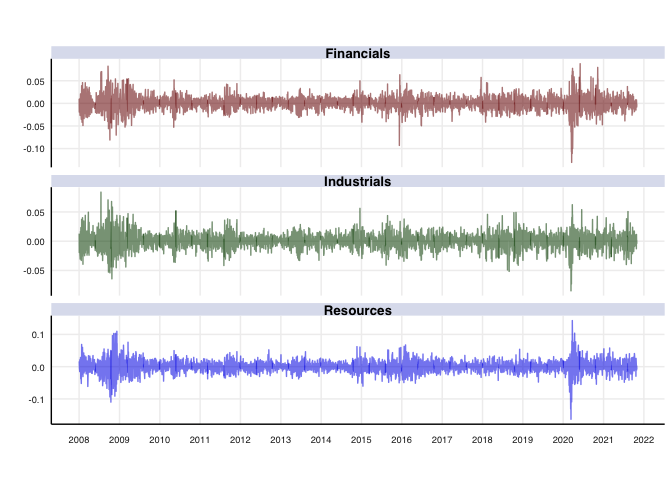

``` r
dcc.time.var.cor_f_plot <- ggplot(dcc.time.var.cor %>% filter(grepl("Financials_", Pairs), !grepl("_Financials", Pairs))) + 
  geom_line(aes(x = date, y = Rho, colour = Pairs)) + 
  theme_hc() + 
  ggtitle("Dynamic Conditional Correlations: Financials") +
  scale_x_date(labels = scales::date_format("%Y"), date_breaks = "1 years") + 
  annotate("text", 
           x = c(as.Date("2014-9-01"), as.Date("2018-12-01"), as.Date( "2019-10-01"), as.Date("2021-1-01"), as.Date("2021-08-01"), as.Date("2022-01-01"), as.Date("2023-03-01")), 
           y = -0.11, 
           label = c("Period 1", "Period 2", "Period 3", "Period 4", "Period 5", "Period 6", "Period 7"),
           angle = 90) +
  xlab("") +
  geom_rect(aes(xmin = as.Date("2014-11-01"), xmax = as.Date("2015-3-31"), ymin = -Inf, ymax = Inf), fill = "lightgray", alpha = 0.01)  +
  geom_rect(aes(xmin = as.Date("2019-02-01"), xmax = as.Date("2019-3-31"), ymin = -Inf, ymax = Inf), fill = "lightgray", alpha = 0.01) +
  geom_rect(aes(xmin = as.Date( "2019-12-01"), xmax = as.Date("2020-3-31"), ymin = -Inf, ymax = Inf), fill = "lightgray", alpha = 0.01) + 
  geom_rect(aes(xmin = as.Date("2021-3-01"), xmax = as.Date("2021-6-30"), ymin = -Inf, ymax = Inf), fill = "lightgray", alpha = 0.01) +
  geom_rect(aes(xmin = as.Date("2021-9-01"), xmax = as.Date("2021-11-30"), ymin = -Inf, ymax = Inf), fill = "lightgray", alpha = 0.01) +
  geom_rect(aes(xmin = as.Date("2022-2-01"), xmax = as.Date("2022-4-30"), ymin = -Inf, ymax = Inf), fill = "lightgray", alpha = 0.01) +
  geom_rect(aes(xmin = as.Date("2022-6-01"), xmax = as.Date("2022-12-31"), ymin = -Inf, ymax = Inf), fill = "lightgray", alpha = 0.01)

dcc.time.var.cor_f_plot
```

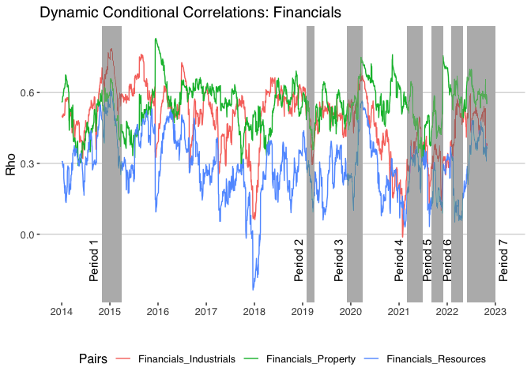

``` r
dcc.time.var.cor_i_plot <- ggplot(dcc.time.var.cor %>% filter(grepl("Industrials_", Pairs), !grepl("_Industrials", Pairs))) + 
  geom_line(aes(x = date, y = Rho, colour = Pairs)) + 
  theme_hc() + 
  ggtitle("Dynamic Conditional Correlations: Industrials") +
  scale_x_date(labels = scales::date_format("%Y"), date_breaks = "1 years") + 
  annotate("text", 
           x = c(as.Date("2014-9-01"), as.Date("2018-12-01"), as.Date( "2019-10-01"), as.Date("2021-1-01"), as.Date("2021-08-01"), as.Date("2022-01-01"), as.Date("2023-03-01")), 
           y = 0, 
           label = c("Period 1", "Period 2", "Period 3", "Period 4", "Period 5", "Period 6", "Period 7"),
           angle = 90) +
  xlab("") +
  geom_rect(aes(xmin = as.Date("2014-11-01"), xmax = as.Date("2015-3-31"), ymin = -Inf, ymax = Inf), fill = "lightgray", alpha = 0.01)  +
  geom_rect(aes(xmin = as.Date("2019-02-01"), xmax = as.Date("2019-3-31"), ymin = -Inf, ymax = Inf), fill = "lightgray", alpha = 0.01) +
  geom_rect(aes(xmin = as.Date( "2019-12-01"), xmax = as.Date("2020-3-31"), ymin = -Inf, ymax = Inf), fill = "lightgray", alpha = 0.01) + 
  geom_rect(aes(xmin = as.Date("2021-3-01"), xmax = as.Date("2021-6-30"), ymin = -Inf, ymax = Inf), fill = "lightgray", alpha = 0.01) +
  geom_rect(aes(xmin = as.Date("2021-9-01"), xmax = as.Date("2021-11-30"), ymin = -Inf, ymax = Inf), fill = "lightgray", alpha = 0.01) +
  geom_rect(aes(xmin = as.Date("2022-2-01"), xmax = as.Date("2022-4-30"), ymin = -Inf, ymax = Inf), fill = "lightgray", alpha = 0.01) +
  geom_rect(aes(xmin = as.Date("2022-6-01"), xmax = as.Date("2022-12-31"), ymin = -Inf, ymax = Inf), fill = "lightgray", alpha = 0.01)

dcc.time.var.cor_i_plot
```

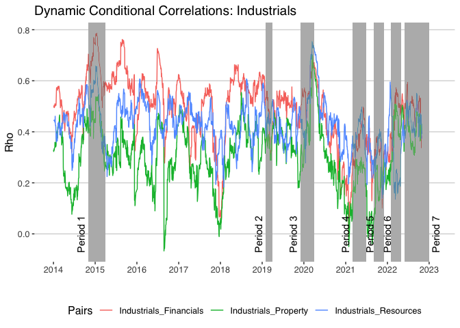

``` r
dcc.time.var.cor_p_plot <- ggplot(dcc.time.var.cor %>% filter(grepl("Property_", Pairs), !grepl("_Property", Pairs))) + 
  geom_line(aes(x = date, y = Rho, colour = Pairs)) + 
  theme_hc() + 
  ggtitle("Dynamic Conditional Correlations: Property") +
  scale_x_date(labels = scales::date_format("%Y"), date_breaks = "1 years") + 
  annotate("text", 
           x = c(as.Date("2014-9-01"), as.Date("2018-12-01"), as.Date( "2019-10-01"), as.Date("2021-1-01"), as.Date("2021-08-01"), as.Date("2022-01-01"), as.Date("2023-03-01")), 
           y = 0, 
           label = c("Period 1", "Period 2", "Period 3", "Period 4", "Period 5", "Period 6", "Period 7"),
           angle = 90) +
  xlab("") +
  geom_rect(aes(xmin = as.Date("2014-11-01"), xmax = as.Date("2015-3-31"), ymin = -Inf, ymax = Inf), fill = "lightgray", alpha = 0.01)  +
  geom_rect(aes(xmin = as.Date("2019-02-01"), xmax = as.Date("2019-3-31"), ymin = -Inf, ymax = Inf), fill = "lightgray", alpha = 0.01) +
  geom_rect(aes(xmin = as.Date( "2019-12-01"), xmax = as.Date("2020-3-31"), ymin = -Inf, ymax = Inf), fill = "lightgray", alpha = 0.01) + 
  geom_rect(aes(xmin = as.Date("2021-3-01"), xmax = as.Date("2021-6-30"), ymin = -Inf, ymax = Inf), fill = "lightgray", alpha = 0.01) +
  geom_rect(aes(xmin = as.Date("2021-9-01"), xmax = as.Date("2021-11-30"), ymin = -Inf, ymax = Inf), fill = "lightgray", alpha = 0.01) +
  geom_rect(aes(xmin = as.Date("2022-2-01"), xmax = as.Date("2022-4-30"), ymin = -Inf, ymax = Inf), fill = "lightgray", alpha = 0.01) +
  geom_rect(aes(xmin = as.Date("2022-6-01"), xmax = as.Date("2022-12-31"), ymin = -Inf, ymax = Inf), fill = "lightgray", alpha = 0.01)

dcc.time.var.cor_p_plot
```

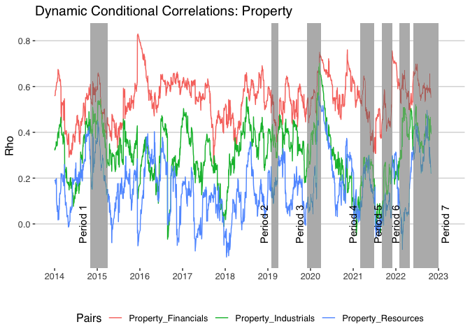

### Load Shedding

First I need to create a dummy column of periods of loadshedding in
order to graph the periods accurately.

``` r
dcc.time.var.cor_ls <- dcc.time.var.cor_ls %>% mutate(Period = case_when(date >= "2014-11-01" & date <= "2015-3-31" ~ "Period 1",
                              date >= "2019-02-01" & date <= "2019-3-31" ~ "Period 2",
                              date >= "2019-12-01" & date <= "2020-3-31" ~ "Period 3",
                              date >= "2021-3-01" & date <= "2021-6-30" ~ "Period 4",
                              date >= "2021-9-01" & date <= "2021-11-30" ~ "Period 5",
                              date >= "2022-2-01" & date <= "2022-4-30" ~ "Period 6",
                              date >= "2022-06-01" & date <= "2022-12-31" ~ "Period 7"))
```

``` r
dcc.time.var.cor_ls_r_plot <- ggplot(dcc.time.var.cor_ls %>% filter(grepl("Resources_", Pairs), !grepl("_Resources", Pairs))) + 
  geom_line(aes(x = date, y = Rho, colour = Pairs)) + 
  theme_hc() + 
  ggtitle("Dynamic Conditional Correlations: Resources", subtitle = "Periods of Loadshedding") +
  facet_grid(~Period, scales = "free_x", space = "free_x") +
  scale_x_date(labels = scales::date_format("%Y %b"), date_breaks = "3 months") + 
  theme(axis.text = element_text(size = 7)) +
  xlab("") 
  

dcc.time.var.cor_ls_r_plot
```

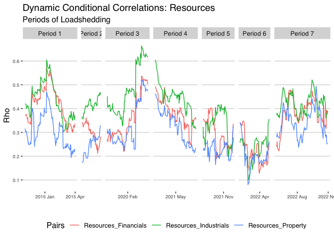

``` r
dcc.time.var.cor_ls_i_plot <- ggplot(dcc.time.var.cor_ls %>% filter(grepl("Industrials_", Pairs), !grepl("_Industrials", Pairs))) + 
  geom_line(aes(x = date, y = Rho, colour = Pairs)) + 
  theme_hc() + 
  ggtitle("Dynamic Conditional Correlations: Industrials", subtitle = "Periods of Loadshedding") +
  facet_grid(~Period, scales = "free_x", space = "free_x") +
  scale_x_date(labels = scales::date_format("%Y %b"), date_breaks = "3 months") + 
  theme(axis.text = element_text(size = 7)) +
  xlab("") 
  

dcc.time.var.cor_ls_i_plot
```

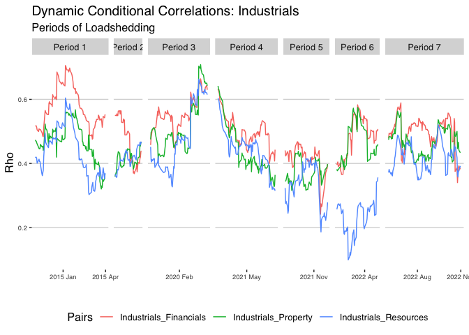

``` r
dcc.time.var.cor_ls_f_plot <- ggplot(dcc.time.var.cor_ls %>% filter(grepl("Financials_", Pairs), !grepl("_Financials", Pairs))) + 
  geom_line(aes(x = date, y = Rho, colour = Pairs)) + 
  theme_hc() + 
  ggtitle("Dynamic Conditional Correlations: Financials", subtitle = "Periods of Loadshedding") +
  facet_grid(~Period, scales = "free_x", space = "free_x") +
  scale_x_date(labels = scales::date_format("%Y %b"), date_breaks = "3 months") + 
  theme(axis.text = element_text(size = 7)) +
  xlab("") 
  

dcc.time.var.cor_ls_f_plot
```

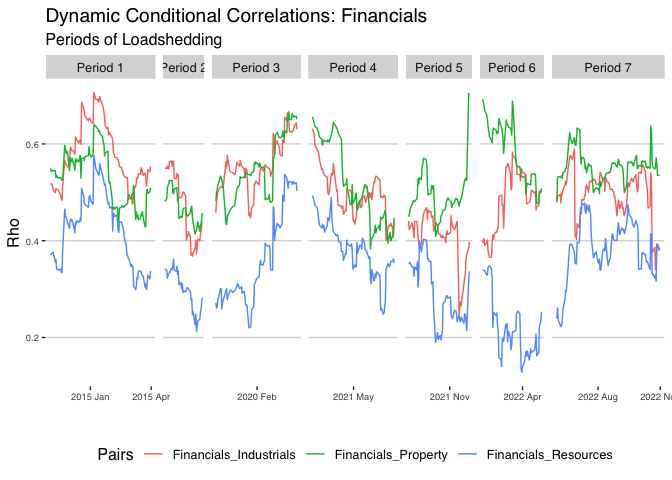

``` r
dcc.time.var.cor_ls_p_plot <- ggplot(dcc.time.var.cor_ls %>% filter(grepl("Property_", Pairs), !grepl("_Property", Pairs))) + 
  geom_line(aes(x = date, y = Rho, colour = Pairs)) + 
  theme_hc() + 
  ggtitle("Dynamic Conditional Correlations: Property", subtitle = "Periods of Loadshedding") +
  facet_grid(~Period, scales = "free_x", space = "free_x") +
  scale_x_date(labels = scales::date_format("%Y %b"), date_breaks = "3 months") + 
  theme(axis.text = element_text(size = 7)) +
  xlab("") 
  

dcc.time.var.cor_ls_p_plot
```

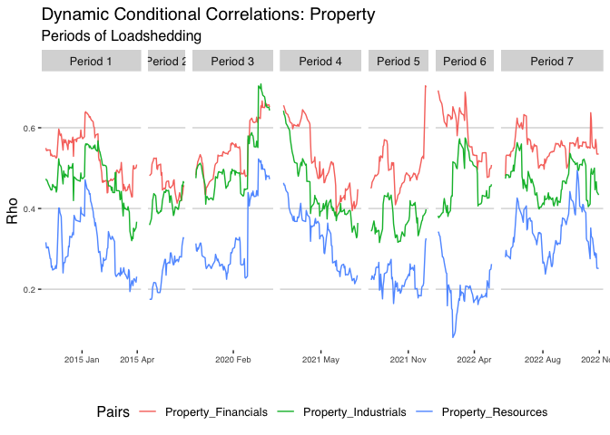

## Summary statistics for DCC output

``` r
dccsummstat <- dcc.time.var.cor %>% spread(key = Pairs, value = Rho) %>% dplyr::select(c(Financials_Industrials, Financials_Resources, Financials_Property, Industrials_Resources, Industrials_Property, Resources_Property)) %>% 
  descr(stats = c("mean", "sd", "min", "max"), round.digits = 4)

colnames(dccsummstat) <- c("Financials -> Industrials", "Financials -> Resources", "Financials -> Property", "Industrials -> Resources", "Industrials -> Property", "Resources -> Property")
round(dccsummstat,4) %>%  t() %>% 
  kable() %>%
  kable_styling(font_size = 9) %>%
  add_footnote("Note: This table provides summary statistics of the dynamic conditional correlations of daily returns of different sectors within the ALSI over the entire period of this study.", notation="none")
```

<table class="table" style="font-size: 9px; margin-left: auto; margin-right: auto;">
<thead>
<tr>
<th style="text-align:left;">
</th>
<th style="text-align:right;">
Mean
</th>
<th style="text-align:right;">
Std.Dev
</th>
<th style="text-align:right;">
Min
</th>
<th style="text-align:right;">
Max
</th>
</tr>
</thead>
<tbody>
<tr>
<td style="text-align:left;">
Financials -\> Industrials
</td>
<td style="text-align:right;">
0.4856
</td>
<td style="text-align:right;">
0.1342
</td>
<td style="text-align:right;">
-0.0124
</td>
<td style="text-align:right;">
0.7865
</td>
</tr>
<tr>
<td style="text-align:left;">
Financials -\> Resources
</td>
<td style="text-align:right;">
0.5443
</td>
<td style="text-align:right;">
0.0949
</td>
<td style="text-align:right;">
0.2640
</td>
<td style="text-align:right;">
0.8294
</td>
</tr>
<tr>
<td style="text-align:left;">
Financials -\> Property
</td>
<td style="text-align:right;">
0.2869
</td>
<td style="text-align:right;">
0.1331
</td>
<td style="text-align:right;">
-0.2362
</td>
<td style="text-align:right;">
0.6137
</td>
</tr>
<tr>
<td style="text-align:left;">
Industrials -\> Resources
</td>
<td style="text-align:right;">
0.3089
</td>
<td style="text-align:right;">
0.1252
</td>
<td style="text-align:right;">
-0.0669
</td>
<td style="text-align:right;">
0.7016
</td>
</tr>
<tr>
<td style="text-align:left;">
Industrials -\> Property
</td>
<td style="text-align:right;">
0.4283
</td>
<td style="text-align:right;">
0.0969
</td>
<td style="text-align:right;">
0.1348
</td>
<td style="text-align:right;">
0.7545
</td>
</tr>
<tr>
<td style="text-align:left;">
Resources -\> Property
</td>
<td style="text-align:right;">
0.1646
</td>
<td style="text-align:right;">
0.1257
</td>
<td style="text-align:right;">
-0.1447
</td>
<td style="text-align:right;">
0.5596
</td>
</tr>
</tbody>
<tfoot>
<tr>
<td style="padding: 0; border:0;" colspan="100%">
<sup></sup> Note: This table provides summary statistics of the dynamic
conditional correlations of daily returns of different sectors within
the ALSI over the entire period of this study.
</td>
</tr>
</tfoot>
</table>

``` r
dccsummstat_ls <- dcc.time.var.cor_ls %>% spread(key = Pairs, value = Rho) %>% dplyr::select(c(Financials_Industrials, Financials_Resources, Financials_Property, Industrials_Resources, Industrials_Property, Resources_Property)) %>% 
  descr(stats = c("mean", "sd", "min", "max"), round.digits = 4)

colnames(dccsummstat_ls) <- c("Financials -> Industrials", "Financials -> Resources", "Financials -> Property", "Industrials -> Resources", "Industrials -> Property", "Resources -> Property")
round(dccsummstat_ls,4) %>%  t() %>% 
  kable() %>%
  kable_styling(font_size = 9) %>%
  add_footnote("Note: This table provides summary statistics of the dynamic conditional correlations of daily returns of different sectors within the ALSI over the periods that encounter loadshedding in this study.", notation="none")
```

<table class="table" style="font-size: 9px; margin-left: auto; margin-right: auto;">
<thead>
<tr>
<th style="text-align:left;">
</th>
<th style="text-align:right;">
Mean
</th>
<th style="text-align:right;">
Std.Dev
</th>
<th style="text-align:right;">
Min
</th>
<th style="text-align:right;">
Max
</th>
</tr>
</thead>
<tbody>
<tr>
<td style="text-align:left;">
Financials -\> Industrials
</td>
<td style="text-align:right;">
0.5077
</td>
<td style="text-align:right;">
0.0763
</td>
<td style="text-align:right;">
0.2413
</td>
<td style="text-align:right;">
0.7059
</td>
</tr>
<tr>
<td style="text-align:left;">
Financials -\> Resources
</td>
<td style="text-align:right;">
0.5344
</td>
<td style="text-align:right;">
0.0655
</td>
<td style="text-align:right;">
0.3827
</td>
<td style="text-align:right;">
0.7042
</td>
</tr>
<tr>
<td style="text-align:left;">
Financials -\> Property
</td>
<td style="text-align:right;">
0.3516
</td>
<td style="text-align:right;">
0.0914
</td>
<td style="text-align:right;">
0.1279
</td>
<td style="text-align:right;">
0.5758
</td>
</tr>
<tr>
<td style="text-align:left;">
Industrials -\> Resources
</td>
<td style="text-align:right;">
0.4565
</td>
<td style="text-align:right;">
0.0730
</td>
<td style="text-align:right;">
0.3156
</td>
<td style="text-align:right;">
0.7085
</td>
</tr>
<tr>
<td style="text-align:left;">
Industrials -\> Property
</td>
<td style="text-align:right;">
0.4050
</td>
<td style="text-align:right;">
0.1006
</td>
<td style="text-align:right;">
0.0987
</td>
<td style="text-align:right;">
0.6634
</td>
</tr>
<tr>
<td style="text-align:left;">
Resources -\> Property
</td>
<td style="text-align:right;">
0.2957
</td>
<td style="text-align:right;">
0.0824
</td>
<td style="text-align:right;">
0.0803
</td>
<td style="text-align:right;">
0.5228
</td>
</tr>
</tbody>
<tfoot>
<tr>
<td style="padding: 0; border:0;" colspan="100%">
<sup></sup> Note: This table provides summary statistics of the dynamic
conditional correlations of daily returns of different sectors within
the ALSI over the periods that encounter loadshedding in this study.
</td>
</tr>
</tfoot>
</table>

``` r
dccsummstat_nls <- dcc.time.var.cor_nls %>% spread(key = Pairs, value = Rho) %>% dplyr::select(c(Financials_Industrials, Financials_Resources, Financials_Property, Industrials_Resources, Industrials_Property, Resources_Property)) %>% 
  descr(stats = c("mean", "sd", "min", "max"), round.digits = 4)

colnames(dccsummstat_nls) <- c("Financials -> Industrials", "Financials -> Resources", "Financials -> Property", "Industrials -> Resources", "Industrials -> Property", "Resources -> Property")
round(dccsummstat_nls,4) %>%  t() %>% 
  kable() %>%
  kable_styling(font_size = 9) %>%
  add_footnote("Note: This table provides summary statistics of the dynamic conditional correlations of daily returns of different sectors within the ALSI over the periods that do not encounter loadshedding in this study.", notation="none")
```

<table class="table" style="font-size: 9px; margin-left: auto; margin-right: auto;">
<thead>
<tr>
<th style="text-align:left;">
</th>
<th style="text-align:right;">
Mean
</th>
<th style="text-align:right;">
Std.Dev
</th>
<th style="text-align:right;">
Min
</th>
<th style="text-align:right;">
Max
</th>
</tr>
</thead>
<tbody>
<tr>
<td style="text-align:left;">
Financials -\> Industrials
</td>
<td style="text-align:right;">
0.4809
</td>
<td style="text-align:right;">
0.1287
</td>
<td style="text-align:right;">
0.0128
</td>
<td style="text-align:right;">
0.7520
</td>
</tr>
<tr>
<td style="text-align:left;">
Financials -\> Resources
</td>
<td style="text-align:right;">
0.5440
</td>
<td style="text-align:right;">
0.0877
</td>
<td style="text-align:right;">
0.2343
</td>
<td style="text-align:right;">
0.8391
</td>
</tr>
<tr>
<td style="text-align:left;">
Financials -\> Property
</td>
<td style="text-align:right;">
0.2744
</td>
<td style="text-align:right;">
0.1260
</td>
<td style="text-align:right;">
-0.2475
</td>
<td style="text-align:right;">
0.5506
</td>
</tr>
<tr>
<td style="text-align:left;">
Industrials -\> Resources
</td>
<td style="text-align:right;">
0.2642
</td>
<td style="text-align:right;">
0.1138
</td>
<td style="text-align:right;">
-0.1141
</td>
<td style="text-align:right;">
0.5330
</td>
</tr>
<tr>
<td style="text-align:left;">
Industrials -\> Property
</td>
<td style="text-align:right;">
0.4384
</td>
<td style="text-align:right;">
0.0794
</td>
<td style="text-align:right;">
0.1904
</td>
<td style="text-align:right;">
0.6814
</td>
</tr>
<tr>
<td style="text-align:left;">
Resources -\> Property
</td>
<td style="text-align:right;">
0.1434
</td>
<td style="text-align:right;">
0.1158
</td>
<td style="text-align:right;">
-0.1522
</td>
<td style="text-align:right;">
0.5349
</td>
</tr>
</tbody>
<tfoot>
<tr>
<td style="padding: 0; border:0;" colspan="100%">
<sup></sup> Note: This table provides summary statistics of the dynamic
conditional correlations of daily returns of different sectors within
the ALSI over the periods that do not encounter loadshedding in this
study.
</td>
</tr>
</tfoot>
</table>

``` r
summstats_all <- xts_alsi_return %>% 
  descr(stats = c("mean", "med", "sd", "min", "max", "skewness", "kurtosis", "n.valid"), round.digits = 4, order = c("Financials", "Industrials", "Resources"))
```

    ## column(s) not specified in 'order' (Property) will appear at the end of the table

``` r
rownames(summstats_all) <- c("Mean", "Median", "Std.Dev", "Min", "Max", "Skewness", "Kurtosis", "Observations" )

round(summstats_all,4) %>% kable() %>% kable_styling(font_size = 9)
```

<table class="table" style="font-size: 9px; margin-left: auto; margin-right: auto;">
<thead>
<tr>
<th style="text-align:left;">
</th>
<th style="text-align:right;">
Financials
</th>
<th style="text-align:right;">
Industrials
</th>
<th style="text-align:right;">
Resources
</th>
<th style="text-align:right;">
Property
</th>
</tr>
</thead>
<tbody>
<tr>
<td style="text-align:left;">
Mean
</td>
<td style="text-align:right;">
0.0004
</td>
<td style="text-align:right;">
0.0003
</td>
<td style="text-align:right;">
0.0005
</td>
<td style="text-align:right;">
0.0000
</td>
</tr>
<tr>
<td style="text-align:left;">
Median
</td>
<td style="text-align:right;">
0.0006
</td>
<td style="text-align:right;">
0.0006
</td>
<td style="text-align:right;">
0.0004
</td>
<td style="text-align:right;">
-0.0002
</td>
</tr>
<tr>
<td style="text-align:left;">
Std.Dev
</td>
<td style="text-align:right;">
0.0161
</td>
<td style="text-align:right;">
0.0126
</td>
<td style="text-align:right;">
0.0185
</td>
<td style="text-align:right;">
0.0171
</td>
</tr>
<tr>
<td style="text-align:left;">
Min
</td>
<td style="text-align:right;">
-0.1227
</td>
<td style="text-align:right;">
-0.0881
</td>
<td style="text-align:right;">
-0.1457
</td>
<td style="text-align:right;">
-0.1935
</td>
</tr>
<tr>
<td style="text-align:left;">
Max
</td>
<td style="text-align:right;">
0.0885
</td>
<td style="text-align:right;">
0.0761
</td>
<td style="text-align:right;">
0.1353
</td>
<td style="text-align:right;">
0.1549
</td>
</tr>
<tr>
<td style="text-align:left;">
Skewness
</td>
<td style="text-align:right;">
-0.3902
</td>
<td style="text-align:right;">
-0.1333
</td>
<td style="text-align:right;">
-0.1218
</td>
<td style="text-align:right;">
-0.8370
</td>
</tr>
<tr>
<td style="text-align:left;">
Kurtosis
</td>
<td style="text-align:right;">
6.3353
</td>
<td style="text-align:right;">
3.5137
</td>
<td style="text-align:right;">
5.0679
</td>
<td style="text-align:right;">
26.4552
</td>
</tr>
<tr>
<td style="text-align:left;">
Observations
</td>
<td style="text-align:right;">
2208.0000
</td>
<td style="text-align:right;">
2208.0000
</td>
<td style="text-align:right;">
2208.0000
</td>
<td style="text-align:right;">
2208.0000
</td>
</tr>
</tbody>
</table>

``` r
summstats_loadshed <- xts_alsi_return_loadshed %>% 
  descr(stats = c("mean", "med", "sd", "min", "max", "skewness", "kurtosis", "n.valid"), round.digits = 4, order = c("Financials", "Industrials", "Resources", "Property"))

rownames(summstats_loadshed) <- c("Mean", "Median", "Std.Dev", "Min", "Max", "Skewness", "Kurtosis", "Observations" )

round(summstats_loadshed,4) %>% kable() %>% kable_styling(font_size = 9)
```

<table class="table" style="font-size: 9px; margin-left: auto; margin-right: auto;">
<thead>
<tr>
<th style="text-align:left;">
</th>
<th style="text-align:right;">
Financials
</th>
<th style="text-align:right;">
Industrials
</th>
<th style="text-align:right;">
Resources
</th>
<th style="text-align:right;">
Property
</th>
</tr>
</thead>
<tbody>
<tr>
<td style="text-align:left;">
Mean
</td>
<td style="text-align:right;">
-0.0005
</td>
<td style="text-align:right;">
0.0004
</td>
<td style="text-align:right;">
-0.0002
</td>
<td style="text-align:right;">
-0.0010
</td>
</tr>
<tr>
<td style="text-align:left;">
Median
</td>
<td style="text-align:right;">
0.0000
</td>
<td style="text-align:right;">
0.0005
</td>
<td style="text-align:right;">
-0.0003
</td>
<td style="text-align:right;">
-0.0008
</td>
</tr>
<tr>
<td style="text-align:left;">
Std.Dev
</td>
<td style="text-align:right;">
0.0187
</td>
<td style="text-align:right;">
0.0152
</td>
<td style="text-align:right;">
0.0228
</td>
<td style="text-align:right;">
0.0216
</td>
</tr>
<tr>
<td style="text-align:left;">
Min
</td>
<td style="text-align:right;">
-0.1227
</td>
<td style="text-align:right;">
-0.0881
</td>
<td style="text-align:right;">
-0.1457
</td>
<td style="text-align:right;">
-0.1935
</td>
</tr>
<tr>
<td style="text-align:left;">
Max
</td>
<td style="text-align:right;">
0.0791
</td>
<td style="text-align:right;">
0.0761
</td>
<td style="text-align:right;">
0.1353
</td>
<td style="text-align:right;">
0.1549
</td>
</tr>
<tr>
<td style="text-align:left;">
Skewness
</td>
<td style="text-align:right;">
-1.2693
</td>
<td style="text-align:right;">
-0.3178
</td>
<td style="text-align:right;">
-0.4483
</td>
<td style="text-align:right;">
-2.4316
</td>
</tr>
<tr>
<td style="text-align:left;">
Kurtosis
</td>
<td style="text-align:right;">
9.7290
</td>
<td style="text-align:right;">
4.9803
</td>
<td style="text-align:right;">
7.1589
</td>
<td style="text-align:right;">
31.4396
</td>
</tr>
<tr>
<td style="text-align:left;">
Observations
</td>
<td style="text-align:right;">
539.0000
</td>
<td style="text-align:right;">
539.0000
</td>
<td style="text-align:right;">
539.0000
</td>
<td style="text-align:right;">
539.0000
</td>
</tr>
</tbody>
</table>

``` r
summstats_no_loadshed <- xts_alsi_return_no_loadshed %>% 
  descr(stats = c("mean", "med", "sd", "min", "max", "skewness", "kurtosis", "n.valid"), round.digits = 4, order = c("Financials", "Industrials", "Resources", "Property"))

rownames(summstats_no_loadshed) <- c("Mean", "Median", "Std.Dev", "Min", "Max", "Skewness", "Kurtosis", "Observations" )

round(summstats_no_loadshed,4) %>% kable() %>% kable_styling(font_size = 9)
```

<table class="table" style="font-size: 9px; margin-left: auto; margin-right: auto;">
<thead>
<tr>
<th style="text-align:left;">
</th>
<th style="text-align:right;">
Financials
</th>
<th style="text-align:right;">
Industrials
</th>
<th style="text-align:right;">
Resources
</th>
<th style="text-align:right;">
Property
</th>
</tr>
</thead>
<tbody>
<tr>
<td style="text-align:left;">
Mean
</td>
<td style="text-align:right;">
0.0007
</td>
<td style="text-align:right;">
0.0003
</td>
<td style="text-align:right;">
0.0008
</td>
<td style="text-align:right;">
0.0003
</td>
</tr>
<tr>
<td style="text-align:left;">
Median
</td>
<td style="text-align:right;">
0.0009
</td>
<td style="text-align:right;">
0.0006
</td>
<td style="text-align:right;">
0.0005
</td>
<td style="text-align:right;">
0.0002
</td>
</tr>
<tr>
<td style="text-align:left;">
Std.Dev
</td>
<td style="text-align:right;">
0.0152
</td>
<td style="text-align:right;">
0.0116
</td>
<td style="text-align:right;">
0.0168
</td>
<td style="text-align:right;">
0.0154
</td>
</tr>
<tr>
<td style="text-align:left;">
Min
</td>
<td style="text-align:right;">
-0.0868
</td>
<td style="text-align:right;">
-0.0419
</td>
<td style="text-align:right;">
-0.0587
</td>
<td style="text-align:right;">
-0.1127
</td>
</tr>
<tr>
<td style="text-align:left;">
Max
</td>
<td style="text-align:right;">
0.0885
</td>
<td style="text-align:right;">
0.0585
</td>
<td style="text-align:right;">
0.0735
</td>
<td style="text-align:right;">
0.1201
</td>
</tr>
<tr>
<td style="text-align:left;">
Skewness
</td>
<td style="text-align:right;">
0.1848
</td>
<td style="text-align:right;">
0.0033
</td>
<td style="text-align:right;">
0.1830
</td>
<td style="text-align:right;">
0.7064
</td>
</tr>
<tr>
<td style="text-align:left;">
Kurtosis
</td>
<td style="text-align:right;">
2.9537
</td>
<td style="text-align:right;">
1.3261
</td>
<td style="text-align:right;">
1.3513
</td>
<td style="text-align:right;">
13.0976
</td>
</tr>
<tr>
<td style="text-align:left;">
Observations
</td>
<td style="text-align:right;">
1669.0000
</td>
<td style="text-align:right;">
1669.0000
</td>
<td style="text-align:right;">
1669.0000
</td>
<td style="text-align:right;">
1669.0000
</td>
</tr>
</tbody>
</table>
