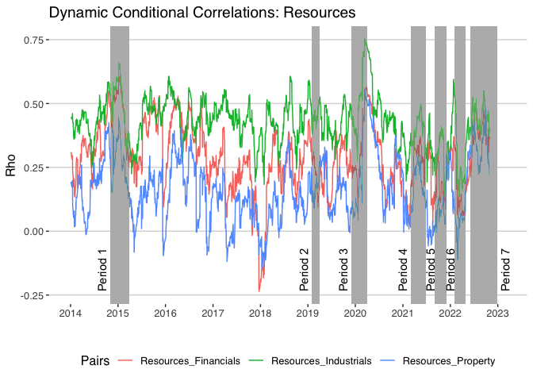

``` r
pacman::p_load(modelsummary, gt, knitr, kableExtra, tidyverse, lubridate, tinytex, rmarkdown, crypto2, quantmod, MTS, rmgarch, rugarch, tbl2xts, fmxdat, ggthemes, summarytools, vars, tseries, pander, cowplot, qpcR, tidyquant, stargazer)

list.files('code/', full.names = T, recursive = T) %>% as.list() %>% walk(~source(.))
```

# FMX PROJECT

``` r
CHOSEN_LOCATION <- "/Users/svenwellmann/Desktop/Masters Semester 2/Financial Econometrics/FMX_Project/"
fmxdat::make_project(FilePath = glue::glue("{CHOSEN_LOCATION}"), ProjNam = "20850980Project", Mac = TRUE)

Texevier::create_template(directory = glue::glue("{CHOSEN_LOCATION}"), template_name = "Paper")
```

# Get Data

First I get the tickers for the top 40 from the data given for the
practical exam. I then use these tickers to pull data more recent data
using the tidyquant package. The ticker names have to be cleaned and
some errors are fixed to get as much data as possible. This is calling
the tq_get() function on the cleaned ticker values from the top 40.
There are tickers that data was not received for. These tickers either
have names that have been changed or their tickers do not correspond to
the tickers that are retrieved through tidyquant from Yahoo Finance. I
then manually change these ticker names and pull the data again.

``` r
T40 <- read_rds("data/T40.rds")

T40 %>% pull(date) %>%  max()

unique_tickers <- T40 %>% pull(Tickers) %>% unique() %>% data.frame()
colnames(unique_tickers) <- "tick"

unique_tickers_clean <- unique_tickers %>% mutate(Tickers = gsub(" SJ Equity", ".JO", tick)) %>% pull(Tickers)

# Download historical data for tickers for the JSE into R
# stock_data <- tq_get(unique_tickers_clean, from = "2014-01-01", to = "2022-12-31", get = "stock.prices", quiet = TRUE)

# stock_data_tickers <- stock_data %>% pull(symbol) %>% unique()

# unique_tickers_clean[!unique_tickers_clean %in% stock_data_tickers] 

# BHP.JO = BHG.JO
# SAB.JO = SZK.JO
# ITU.JO = ITE.JO
# IPL.JO = 
# LGL.JO = 
# LON.JO = 
# MND.JO = GND.JO
# REI.JO = 
# LBH.JO = LBR.JO
# MSM.JO = 
# ASR.JO = ADR.JO
# MDC.JO = 
# PSG.JO = KST.JO
# NEP.JO = 
# NHM.JO =
```

Here I have appended the missing tickers that I found. I get the data
daily from 1 January 2014 to 31 December 2022. These dates were chosen
as they correspond to periods with loadshedding. I then get the sectors
of the Stocks and add the sectors of the changed variables.

``` r
unique_tickers_clean <- c(unique_tickers_clean, "BHG.JO", "SZK.JO", "ITE.JO", "GND.JO", "LBR.JO", "ADR.JO", "KST.JO")

stock_data <- tq_get(unique_tickers_clean, from = "2014-01-01", to = "2022-12-31", get = "stock.prices", quiet = TRUE)

stock_data %>% pull(symbol) %>% unique

stock_data <- stock_data %>% dplyr::select(symbol, date, close)
colnames(stock_data) <- c("Tickers", "date", "close")

stocks_sectors <- left_join(x = stock_data, y = T40 %>% dplyr:::select(Tickers, Sector) %>% unique %>% mutate(Tickers = gsub(" SJ Equity", ".JO", Tickers)))


# Add the sector to the changed variables
stocks_sectors <- stocks_sectors %>% 
    mutate(Sector = case_when(Tickers == "BHG.JO" & is.na(Sector) ~ "Resources",
                              Tickers == "SZK.JO" & is.na(Sector) ~ "Industrials",
                              Tickers == "ITE.JO" & is.na(Sector) ~ "Financials",
                              Tickers == "GND.JO" & is.na(Sector) ~ "Resources",
                              Tickers == "LBR.JO" & is.na(Sector) ~ "Financials",
                              Tickers == "ADR.JO" & is.na(Sector) ~ "Resources",
                              Tickers == "KST.JO" & is.na(Sector) ~ "Financials",
                              TRUE ~ Sector))

#adr.jo <- stocks_sectors %>% filter(Tickers %in% "ADR.JO") %>% arrange(date) %>% unique
#gnd.jo <- stocks_sectors %>% filter(Tickers %in% "GND.JO") %>% arrange(date) %>% unique

stocks_sectors <- stocks_sectors %>% 
  group_by(Tickers, Sector) %>% 
  filter(!any(Tickers == "REM.JO" & Sector == "Financials")) %>% 
  filter(!any(Tickers == "MNP.JO" & Sector == "Industrials")) 
#%>% 
 # filter(!any(Tickers == "ADR.JO")) %>% 
  #filter(!any(Tickers == "GND.JO")) 

#stocks_sectors <- rbind(stocks_sectors, adr.jo, gnd.jo)

# length(stocks_sectors$Tickers) -length(stocks_sectors %>% distinct(Tickers, date, .keep_all = TRUE) %>% pull(Tickers))

stocks_sectors <- stocks_sectors %>% distinct(Tickers, date, .keep_all = TRUE)
```

I have then used a few sources to identify the periods of loadshedding
in South Africa. I have identified periods: \* November 2014 - March of
2015 \* February 2019 - March 2019 \* December 2019 - March 2020 \*
March 2021 - June 2021 \* October 2021 - November 2021 \* February
2022 - April 2022 \* June 2022 - December 2022

``` r
stocks_loadshed <- rbind(
stocks_sectors %>% filter(date >= "2014-11-01" & date <= "2015-3-31"),
stocks_sectors %>% filter(date >= "2019-02-01" & date <= "2019-3-31"),
stocks_sectors %>% filter(date >= "2019-12-01" & date <= "2020-3-31"),
stocks_sectors %>% filter(date >= "2021-3-01" & date <= "2021-6-30"),
stocks_sectors %>% filter(date >= "2021-9-01" & date <= "2021-11-30"),
stocks_sectors %>% filter(date >= "2022-2-01" & date <= "2022-4-30"),
stocks_sectors %>% filter(date >= "2022-6-01" & date <= "2022-12-31"))

stocks_no_loadshed <- stocks_sectors %>% filter(!date %in% (stocks_loadshed %>% pull(date)))
```

I then look at the stocks for NA values. There are only 2 stocks with NA
values. OML.JO and SOL.JO. OML.JO has 680 missing values out of 1706.
The stock has no information after 26 of June 2018. Due to these reasons
the stock is removed form the study.

``` r
stocks_no_loadshed %>% group_by(Tickers) %>% summarise(na_count = sum(is.na(close))) %>% filter(na_count>0)

stocks_loadshed <- stocks_loadshed %>% filter(!Tickers %in% "OML.JO")
stocks_no_loadshed <- stocks_no_loadshed %>% filter(!Tickers %in% "OML.JO")
```

Now I get the returns for all the stocks and impute any missing returns
based on the collective distribution.

``` r
loadshed_returns <- stocks_loadshed %>% 
    arrange(date) %>% 
    group_by(Tickers) %>% 
    mutate(simpleret = close/ lag(close)) %>% 
    mutate(dlogret = log(close) - log(lag(close))) %>% 
    mutate(scaledret = (dlogret - mean(dlogret, na.rm = T))) %>% 
    filter(date>min(date))

no_loadshed_returns <- stocks_no_loadshed %>% 
    arrange(date) %>% 
    group_by(Tickers) %>% 
    mutate(simpleret = close/ lag(close)) %>% 
    mutate(dlogret = log(close) - log(lag(close))) %>% 
    mutate(scaledret = (dlogret - mean(dlogret, na.rm = T))) %>% 
    filter(date>min(date))

xts_loadshed_return <- loadshed_returns %>% tbl_xts(., cols_to_xts = "dlogret", spread_by = "Tickers")
xts_no_loadshed_return <- no_loadshed_returns %>% tbl_xts(., cols_to_xts = "dlogret", spread_by = "Tickers")

loadshed_returns <- impute_missing_returns(loadshed_returns, impute_returns_method = "Drawn_Distribution_Collective")


stocks_sectors %>% group_by(Tickers) %>% summarise(first_date = min(date))
```

# Doing the analysis with data given during the practical test

``` r
T40 <- read_rds("data/T40.rds")

T40 %>% pull(date) %>% max()
```

    ## [1] "2021-10-29"

``` r
sectors <- T40 %>% pull(Sector) %>% unique()
sector_return <- list()
for(i in 1:length(sectors)){
    # Loop through sectors and calculate returns and cumulative returns
    sector_return[[i]] <- portfolio_return_function(T40, sector = sectors[i]) %>% group_by(Portfolio) %>% 
      mutate(cumreturn_Rand = (cumprod(1 + Returns))) %>% # Start at 1
      mutate(cumreturn_Rand = cumreturn_Rand/dplyr:::first(cumreturn_Rand)) %>% 
      mutate(Sector = sectors[i])
}
# Rename tibbles
names(sector_return) <- sectors
sector_return
```

    ## $Resources
    ## # A tibble: 6,916 × 5
    ## # Groups:   Portfolio [2]
    ##    date       Portfolio   Returns cumreturn_Rand Sector   
    ##    <date>     <chr>         <dbl>          <dbl> <chr>    
    ##  1 2008-01-02 J200       0.0148            1     Resources
    ##  2 2008-01-02 J400       0.0164            1     Resources
    ##  3 2008-01-03 J200       0.00699           1.01  Resources
    ##  4 2008-01-03 J400       0.0131            1.01  Resources
    ##  5 2008-01-04 J200      -0.000828          1.01  Resources
    ##  6 2008-01-04 J400      -0.00315           1.01  Resources
    ##  7 2008-01-07 J200      -0.0184            0.988 Resources
    ##  8 2008-01-07 J400      -0.0153            0.994 Resources
    ##  9 2008-01-08 J200       0.0151            1.00  Resources
    ## 10 2008-01-08 J400       0.0213            1.02  Resources
    ## # … with 6,906 more rows
    ## 
    ## $Industrials
    ## # A tibble: 6,916 × 5
    ## # Groups:   Portfolio [2]
    ##    date       Portfolio  Returns cumreturn_Rand Sector     
    ##    <date>     <chr>        <dbl>          <dbl> <chr>      
    ##  1 2008-01-02 J200       0.0123           1     Industrials
    ##  2 2008-01-02 J400       0.0130           1     Industrials
    ##  3 2008-01-03 J200      -0.0179           0.982 Industrials
    ##  4 2008-01-03 J400      -0.0194           0.981 Industrials
    ##  5 2008-01-04 J200      -0.00681          0.975 Industrials
    ##  6 2008-01-04 J400      -0.00380          0.977 Industrials
    ##  7 2008-01-07 J200      -0.00122          0.974 Industrials
    ##  8 2008-01-07 J400      -0.00368          0.973 Industrials
    ##  9 2008-01-08 J200       0.00680          0.981 Industrials
    ## 10 2008-01-08 J400       0.00481          0.978 Industrials
    ## # … with 6,906 more rows
    ## 
    ## $Financials
    ## # A tibble: 6,916 × 5
    ## # Groups:   Portfolio [2]
    ##    date       Portfolio  Returns cumreturn_Rand Sector    
    ##    <date>     <chr>        <dbl>          <dbl> <chr>     
    ##  1 2008-01-02 J200       0.00808          1     Financials
    ##  2 2008-01-02 J400       0.0101           1     Financials
    ##  3 2008-01-03 J200      -0.0189           0.981 Financials
    ##  4 2008-01-03 J400      -0.0193           0.981 Financials
    ##  5 2008-01-04 J200      -0.0158           0.966 Financials
    ##  6 2008-01-04 J400      -0.0132           0.968 Financials
    ##  7 2008-01-07 J200      -0.00957          0.956 Financials
    ##  8 2008-01-07 J400      -0.00907          0.959 Financials
    ##  9 2008-01-08 J200       0.00818          0.964 Financials
    ## 10 2008-01-08 J400       0.0102           0.969 Financials
    ## # … with 6,906 more rows

``` r
# Combine Dataframes
sectors_cum_return <- rbind(sector_return[[1]], sector_return[[2]], sector_return[[3]]) %>% arrange(date)
    
sectors_cum_return_plot <- sectors_cum_return %>% 
    ggplot() +
    geom_line(aes(date, cumreturn_Rand, colour = Portfolio), alpha = 0.8) + facet_wrap(~Sector) + fmxdat::fmx_cols() + 
    labs(title = "Cumulative Returns per Sector for ALSI and SWIX", y = "Cumulative Returns", x = "") + 
    fmxdat::theme_fmx(title.size = ggpts(25))
sectors_cum_return_plot
```


Subset the data into times of loadshedding and times without.

``` r
sectors_cum_return <- sectors_cum_return %>% filter(Portfolio == 'J400') # SWIX

swix_loadshed <- rbind(
sectors_cum_return %>% filter(date >= "2014-11-01" & date <= "2015-3-31"),
sectors_cum_return %>% filter(date >= "2019-02-01" & date <= "2019-3-31"),
sectors_cum_return %>% filter(date >= "2019-12-01" & date <= "2020-3-31"),
sectors_cum_return %>% filter(date >= "2021-3-01" & date <= "2021-6-30"),
sectors_cum_return %>% filter(date >= "2021-9-01" & date <= "2021-11-30"),
sectors_cum_return %>% filter(date >= "2022-2-01" & date <= "2022-4-30"),
sectors_cum_return %>% filter(date >= "2022-6-01" & date <= "2022-12-31"))

swix_no_loadshed <- sectors_cum_return %>% filter(!date %in% (swix_loadshed %>% pull(date)))

xts_swix_return <- sectors_cum_return %>% tbl_xts(., cols_to_xts = "Returns", spread_by = "Sector") 

xts_swix_return_loadshed <- swix_loadshed %>% tbl_xts(., cols_to_xts = "Returns", spread_by = "Sector") 
xts_swix_return_no_loadshed <- swix_no_loadshed %>% tbl_xts(., cols_to_xts = "Returns", spread_by = "Sector") 
```

Plotting the Log returns of all sectors across the entire period.

``` r
log_returns_plot <- sectors_cum_return %>% mutate(Sector = factor(Sector, levels = c("Financials",  "Industrials", "Resources"))) %>% 
  ggplot() + geom_line(aes(x = date, y = Returns, colour = Sector, alpha = 1)) + 
#ggtitle("Daily Log Returns") + 
facet_wrap(~Sector, scales = "free_y", nrow = 3) + 
guides(alpha = "none") + 
fmxdat::theme_fmx() +
labs(x = "", y = "", subtitle = " ") +
theme(legend.position = "none") +
scale_color_hue(l = 20) + 
scale_x_date(labels = scales::date_format("%Y"), date_breaks = "1 years") + 
    
theme(axis.text = element_text(size = 7))

log_returns_plot
```


# Fit DCC models

## Whole Period

``` r
# Using the rugarch package, let's specify our own univariate
# functions to be used in the dcc process:

# Step 1: Give the specifications to be used first:

# A) Univariate GARCH specifications:
uspec <- ugarchspec(variance.model = list(model = "gjrGARCH", garchOrder = c(1, 1)), mean.model = list(armaOrder = c(1, 0), include.mean = TRUE), distribution.model = "sstd")
# B) Repeat uspec n times. This specification should be
# self-explanatory...
multi_univ_garch_spec <- multispec(replicate(ncol(xts_swix_return), uspec))
multi_univ_garch_spec_ls <- multispec(replicate(ncol(xts_swix_return_loadshed), uspec))
multi_univ_garch_spec_nls <- multispec(replicate(ncol(xts_swix_return_no_loadshed), uspec))

# Right, so now every series will have a GJR Garch univariate
# specification. (see ?ugarchspec for other options...)

# C) DCC Specs
spec.dcc = dccspec(multi_univ_garch_spec, dccOrder = c(1, 1), distribution = "mvnorm", lag.criterion = c("AIC", "HQ", "SC", "FPE")[1], model = c("DCC", "aDCC")[1])
spec.dcc_ls = dccspec(multi_univ_garch_spec_ls, dccOrder = c(1, 1), distribution = "mvnorm", lag.criterion = c("AIC", "HQ", "SC", "FPE")[1], model = c("DCC", "aDCC")[1])
spec.dcc_nls = dccspec(multi_univ_garch_spec_nls, dccOrder = c(1, 1), distribution = "mvnorm", lag.criterion = c("AIC", "HQ", "SC", "FPE")[1], model = c("DCC", "aDCC")[1])

# D) Enable clustering for speed:
cl = makePSOCKcluster(10)

# ------------------------ Step 2: The specs are now saved.
# Let's now build our DCC models...  ------------------------

# First, fit the univariate series for each column:
multf = multifit(multi_univ_garch_spec, xts_swix_return, cluster = cl)
multf_ls = multifit(multi_univ_garch_spec_ls, xts_swix_return_loadshed, cluster = cl)
multf_nls = multifit(multi_univ_garch_spec_nls, xts_swix_return_no_loadshed, cluster = cl)

# Now we can use multf to estimate the dcc model using our
# dcc.spec:
fit.dcc = dccfit(spec.dcc, data = xts_swix_return, solver = "gosolnp", cluster = cl, fit.control = list(eval.se = TRUE), fit = multf)
fit.dcc_ls = dccfit(spec.dcc_ls, data = xts_swix_return_loadshed, solver = "gosolnp", cluster = cl, fit.control = list(eval.se = TRUE), fit = multf_ls)
fit.dcc_nls = dccfit(spec.dcc_nls, data = xts_swix_return_no_loadshed, solver = "gosolnp", cluster = cl, fit.control = list(eval.se = TRUE), fit = multf_nls)

# And that is our DCC fitted model!

# We can now test the model's fit as follows: Let's use the
# covariance matrices to test the adequacy of MV model in
# fitting mean residual processes:
RcovList <- rcov(fit.dcc)  # This is now a list of the monthly covariances of our DCC model series.
RcovList_ls <- rcov(fit.dcc_ls)
RcovList_nls <- rcov(fit.dcc_nls)

covmat = matrix(RcovList, nrow(xts_swix_return), ncol(xts_swix_return) * ncol(xts_swix_return), byrow = TRUE)
covmat_ls = matrix(RcovList, nrow(xts_swix_return_loadshed), ncol(xts_swix_return_loadshed) * ncol(xts_swix_return_loadshed), byrow = TRUE)
```

    ## Warning in matrix(RcovList, nrow(xts_swix_return_loadshed),
    ## ncol(xts_swix_return_loadshed) * : data length [31122] is not a sub-multiple or
    ## multiple of the number of rows [351]

``` r
covmat_nls = matrix(RcovList, nrow(xts_swix_return_no_loadshed), ncol(xts_swix_return_no_loadshed) * ncol(xts_swix_return_no_loadshed), byrow = TRUE)
```

    ## Warning in matrix(RcovList, nrow(xts_swix_return_no_loadshed),
    ## ncol(xts_swix_return_no_loadshed) * : data length [31122] is not a sub-multiple
    ## or multiple of the number of rows [3107]

``` r
mc1 = MCHdiag(xts_swix_return, covmat)
```

    ## Test results:  
    ## Q(m) of et: 
    ## Test and p-value:  13.84826 0.1800263 
    ## Rank-based test: 
    ## Test and p-value:  9.318271 0.5021883 
    ## Qk(m) of epsilon_t: 
    ## Test and p-value:  122.7351 0.012456 
    ## Robust Qk(m):  
    ## Test and p-value:  80.72196 0.7475152

``` r
mc1_ls = MCHdiag(xts_swix_return_loadshed, covmat_ls)
```

    ## Test results:  
    ## Q(m) of et: 
    ## Test and p-value:  340.7819 0 
    ## Rank-based test: 
    ## Test and p-value:  93.51436 1.110223e-15 
    ## Qk(m) of epsilon_t: 
    ## Test and p-value:  598.9079 0 
    ## Robust Qk(m):  
    ## Test and p-value:  137.6818 0.0009136342

``` r
mc1_nls = MCHdiag(xts_swix_return_no_loadshed, covmat_nls)
```

    ## Test results:  
    ## Q(m) of et: 
    ## Test and p-value:  1216.353 0 
    ## Rank-based test: 
    ## Test and p-value:  581.7688 0 
    ## Qk(m) of epsilon_t: 
    ## Test and p-value:  1703.15 0 
    ## Robust Qk(m):  
    ## Test and p-value:  318.3764 0

``` r
dcc.time.var.cor <- rcor(fit.dcc)
dcc.time.var.cor_ls <- rcor(fit.dcc_ls)
dcc.time.var.cor_nls <- rcor(fit.dcc_nls)

dcc.time.var.cor <- aperm(dcc.time.var.cor, c(3, 2, 1))
dcc.time.var.cor_ls <- aperm(dcc.time.var.cor_ls, c(3, 2, 1))
dcc.time.var.cor_nls <- aperm(dcc.time.var.cor_nls, c(3, 2, 1))

dim(dcc.time.var.cor) <- c(nrow(dcc.time.var.cor), ncol(dcc.time.var.cor)^2)
dim(dcc.time.var.cor_ls) <- c(nrow(dcc.time.var.cor_ls), ncol(dcc.time.var.cor_ls)^2)
dim(dcc.time.var.cor_nls) <- c(nrow(dcc.time.var.cor_nls), ncol(dcc.time.var.cor_nls)^2)

dcc.time.var.cor <- renamingdcc(ReturnSeries = xts_swix_return, DCC.TV.Cor = dcc.time.var.cor)
```

    ## Warning: `tbl_df()` was deprecated in dplyr 1.0.0.
    ## ℹ Please use `tibble::as_tibble()` instead.

``` r
dcc.time.var.cor_ls <- renamingdcc(ReturnSeries = xts_swix_return_loadshed, DCC.TV.Cor = dcc.time.var.cor_ls)
dcc.time.var.cor_nls <- renamingdcc(ReturnSeries = xts_swix_return_no_loadshed, DCC.TV.Cor = dcc.time.var.cor_nls)
```

## Plots

### Full Period

``` r
dcc.time.var.cor_r_plot <- ggplot(dcc.time.var.cor %>% filter(grepl("Resources_", Pairs), !grepl("_Resources", Pairs))) + 
  geom_line(aes(x = date, y = Rho, colour = Pairs)) + 
  theme_hc() + 
  ggtitle("Dynamic Conditional Correlations: Resources") + 
  scale_x_date(labels = scales::date_format("%Y"), date_breaks = "1 years") + 
  annotate("text", 
           x = c(as.Date("2014-9-01"), as.Date("2018-12-01"), as.Date( "2019-10-01"), as.Date("2021-1-01"), as.Date("2022-02-01")), 
           y = -0.3, 
           label = c("Period 1", "Period 2", "Period 3", "Period 4", "Period 5"),
           angle = 90) +
  xlab("") +
  geom_rect(aes(xmin = as.Date("2014-11-01"), xmax = as.Date("2015-3-31"), ymin = -Inf, ymax = Inf), fill = "lightgray", alpha = 0.01)  +
  geom_rect(aes(xmin = as.Date("2019-02-01"), xmax = as.Date("2019-3-31"), ymin = -Inf, ymax = Inf), fill = "lightgray", alpha = 0.01) +
  geom_rect(aes(xmin = as.Date( "2019-12-01"), xmax = as.Date("2020-3-31"), ymin = -Inf, ymax = Inf), fill = "lightgray", alpha = 0.01) + 
  geom_rect(aes(xmin = as.Date("2021-3-01"), xmax = as.Date("2021-6-30"), ymin = -Inf, ymax = Inf), fill = "lightgray", alpha = 0.01) +
  geom_rect(aes(xmin = as.Date("2021-9-01"), xmax = as.Date("2021-11-30"), ymin = -Inf, ymax = Inf), fill = "lightgray", alpha = 0.01)

dcc.time.var.cor_r_plot
```



``` r
dcc.time.var.cor_f_plot <- ggplot(dcc.time.var.cor %>% filter(grepl("Financials_", Pairs), !grepl("_Financials", Pairs))) + 
  geom_line(aes(x = date, y = Rho, colour = Pairs)) + 
  theme_hc() + 
  ggtitle("Dynamic Conditional Correlations: Financials") +
  scale_x_date(labels = scales::date_format("%Y"), date_breaks = "1 years") + 
  annotate("text", 
           x = c(as.Date("2014-9-01"), as.Date("2018-12-01"), as.Date( "2019-10-01"), as.Date("2021-1-01"), as.Date("2022-02-01")), 
           y = -0.3, 
           label = c("Period 1", "Period 2", "Period 3", "Period 4", "Period 5"),
           angle = 90) +
  xlab("") +
  geom_rect(aes(xmin = as.Date("2014-11-01"), xmax = as.Date("2015-3-31"), ymin = -Inf, ymax = Inf), fill = "lightgray", alpha = 0.01)  +
  geom_rect(aes(xmin = as.Date("2019-02-01"), xmax = as.Date("2019-3-31"), ymin = -Inf, ymax = Inf), fill = "lightgray", alpha = 0.01) +
  geom_rect(aes(xmin = as.Date( "2019-12-01"), xmax = as.Date("2020-3-31"), ymin = -Inf, ymax = Inf), fill = "lightgray", alpha = 0.01) + 
  geom_rect(aes(xmin = as.Date("2021-3-01"), xmax = as.Date("2021-6-30"), ymin = -Inf, ymax = Inf), fill = "lightgray", alpha = 0.01) +
  geom_rect(aes(xmin = as.Date("2021-9-01"), xmax = as.Date("2021-11-30"), ymin = -Inf, ymax = Inf), fill = "lightgray", alpha = 0.01)

dcc.time.var.cor_f_plot
```


``` r
dcc.time.var.cor_i_plot <- ggplot(dcc.time.var.cor %>% filter(grepl("Industrials_", Pairs), !grepl("_Industrials", Pairs))) + 
  geom_line(aes(x = date, y = Rho, colour = Pairs)) + 
  theme_hc() + 
  ggtitle("Dynamic Conditional Correlations: Industrials") +
  scale_x_date(labels = scales::date_format("%Y"), date_breaks = "1 years") + 
  annotate("text", 
           x = c(as.Date("2014-9-01"), as.Date("2018-12-01"), as.Date( "2019-10-01"), as.Date("2021-1-01"), as.Date("2022-02-01")), 
           y = -0.1, 
           label = c("Period 1", "Period 2", "Period 3", "Period 4", "Period 5"),
           angle = 90) +
  xlab("") +
  geom_rect(aes(xmin = as.Date("2014-11-01"), xmax = as.Date("2015-3-31"), ymin = -Inf, ymax = Inf), fill = "lightgray", alpha = 0.01)  +
  geom_rect(aes(xmin = as.Date("2019-02-01"), xmax = as.Date("2019-3-31"), ymin = -Inf, ymax = Inf), fill = "lightgray", alpha = 0.01) +
  geom_rect(aes(xmin = as.Date( "2019-12-01"), xmax = as.Date("2020-3-31"), ymin = -Inf, ymax = Inf), fill = "lightgray", alpha = 0.01) + 
  geom_rect(aes(xmin = as.Date("2021-3-01"), xmax = as.Date("2021-6-30"), ymin = -Inf, ymax = Inf), fill = "lightgray", alpha = 0.01) +
  geom_rect(aes(xmin = as.Date("2021-9-01"), xmax = as.Date("2021-11-30"), ymin = -Inf, ymax = Inf), fill = "lightgray", alpha = 0.01)

dcc.time.var.cor_i_plot
```


### Load Shedding

First I need to create a dummy column of periods of loadshedding in
order to graph the periods accurately.

``` r
dcc.time.var.cor_ls <- dcc.time.var.cor_ls %>% mutate(Period = case_when(date >= "2014-11-01" & date <= "2015-3-31" ~ "Period 1",
                              date >= "2019-02-01" & date <= "2019-3-31" ~ "Period 2",
                              date >= "2019-12-01" & date <= "2020-3-31" ~ "Period 3",
                              date >= "2021-3-01" & date <= "2021-6-30" ~ "Period 4",
                              date >= "2021-9-01" & date <= "2021-11-30" ~ "Period 5",
                              date >= "2022-2-01" & date <= "2022-4-30" ~ "Period 6"))
```

``` r
dcc.time.var.cor_ls_r_plot <- ggplot(dcc.time.var.cor_ls %>% filter(grepl("Resources_", Pairs), !grepl("_Resources", Pairs))) + 
  geom_line(aes(x = date, y = Rho, colour = Pairs)) + 
  theme_hc() + 
  ggtitle("Dynamic Conditional Correlations: Resources", subtitle = "Periods of Loadshedding") +
  facet_grid(~Period, scales = "free_x", space = "free_x") +
  scale_x_date(labels = scales::date_format("%Y %b"), date_breaks = "2 months") + 
  theme(axis.text = element_text(size = 7)) +
  xlab("") 
  

dcc.time.var.cor_ls_r_plot
```


``` r
dcc.time.var.cor_ls_i_plot <- ggplot(dcc.time.var.cor_ls %>% filter(grepl("Industrials_", Pairs), !grepl("_Industrials", Pairs))) + 
  geom_line(aes(x = date, y = Rho, colour = Pairs)) + 
  theme_hc() + 
  ggtitle("Dynamic Conditional Correlations: Industrials", subtitle = "Periods of Loadshedding") +
  facet_grid(~Period, scales = "free_x", space = "free_x") +
  scale_x_date(labels = scales::date_format("%Y %b"), date_breaks = "2 months") + 
  theme(axis.text = element_text(size = 7)) +
  xlab("") 
  

dcc.time.var.cor_ls_i_plot
```


``` r
dcc.time.var.cor_ls_f_plot <- ggplot(dcc.time.var.cor_ls %>% filter(grepl("Financials_", Pairs), !grepl("_Financials", Pairs))) + 
  geom_line(aes(x = date, y = Rho, colour = Pairs)) + 
  theme_hc() + 
  ggtitle("Dynamic Conditional Correlations: Financials", subtitle = "Periods of Loadshedding") +
  facet_grid(~Period, scales = "free_x", space = "free_x") +
  scale_x_date(labels = scales::date_format("%Y %b"), date_breaks = "2 months") + 
  theme(axis.text = element_text(size = 7)) +
  xlab("") 
  

dcc.time.var.cor_ls_f_plot
```


## Statistics

``` r
stargazer(fit.dcc@mfit$matcoef,
          type = "text",
          title = "DCC GARCH Model Fit \\label{dccfitfull}",
          ci = TRUE,
          ci.level = 0.95,
          p.auto = TRUE,
          star.cutoffs = c(0.05, 0.01, 0.001),
          align = TRUE)
```

    ## 
    ## DCC GARCH Model Fit dccfitfull
    ## ============================================================
    ##                      Estimate Std. Error t value Pr(> | t| )
    ## ------------------------------------------------------------
    ##    [Resources].mu    0.00004    0.0002    0.170     0.865   
    ##   [Resources].ar1     0.030     0.017     1.795     0.073   
    ##  [Resources].omega   0.00000   0.00001    0.304     0.761   
    ##  [Resources].alpha1   0.005     0.033     0.147     0.883   
    ##  [Resources].beta1    0.947     0.050    18.749       0     
    ##  [Resources].gamma1   0.086     0.027     3.183     0.001   
    ##   [Resources].skew    0.981     0.026    38.178       0     
    ##  [Resources].shape    13.588    4.517     3.008     0.003   
    ##   [Industrials].mu    0.001     0.0002    2.777     0.005   
    ##  [Industrials].ar1    -0.028    0.018    -1.608     0.108   
    ## [Industrials].omega  0.00000   0.00000    1.755     0.079   
    ## [Industrials].alpha1  0.017     0.009     1.822     0.068   
    ## [Industrials].beta1   0.907     0.017    54.780       0     
    ## [Industrials].gamma1  0.119     0.025     4.713    0.00000  
    ##  [Industrials].skew   0.907     0.023    40.219       0     
    ## [Industrials].shape   10.257    1.634     6.277       0     
    ##   [Financials].mu     0.0004    0.0002    2.033     0.042   
    ##   [Financials].ar1    -0.011    0.018    -0.620     0.535   
    ##  [Financials].omega  0.00000   0.00000    0.966     0.334   
    ## [Financials].alpha1   0.032     0.022     1.492     0.136   
    ##  [Financials].beta1   0.907     0.033    27.601       0     
    ## [Financials].gamma1   0.097     0.024     4.013    0.0001   
    ##  [Financials].skew    0.970     0.024    40.477       0     
    ##  [Financials].shape   10.568    1.968     5.371    0.00000  
    ##     [Joint]dcca1      0.039     0.005     7.807       0     
    ##     [Joint]dccb1      0.949     0.008    123.275      0     
    ## ------------------------------------------------------------

``` r
#fit.dcc@mfit$matcoef %>% kable() %>% kable_styling()


# add_stars <- function(p) {
#     if (p < 0.001) {
#         return("***")
#     } else if (p < 0.01) {
#         return("**")
#     } else if (p < 0.05) {
#         return("*")
#     } else {
#         return("")
#     }
# }

# fit.dcc@mfit$matcoef[,-3]

# kable(fit.dcc@mfit$matcoef[,-3], caption = "DCC GARCH Model", 
#       col.names = c("Coefficient", "Std. Error", "p-value"), 
#       align = c("l", "c", "c"), 
#       digits = c(2, 2, 3),
#       p.format = add_stars) %>% kable_styling()
```

``` r
stargazer(fit.dcc_ls@mfit$matcoef,
          type = "text",
          title = "Loadshedding DCC GARCH Model Fit \\label{dccfitls}",
          ci = TRUE,
          ci.level = 0.95,
          p.auto = TRUE,
          star.cutoffs = c(0.05, 0.01, 0.001),
          align = TRUE)
```

# Loadshedding DCC GARCH Model Fit dccfitls

## Estimate Std. Error t value Pr(\> \| t\| )

\[Resources\].mu -0.001 0.001 -0.538 0.591  
\[Resources\].ar1 0.029 0.058 0.508 0.611  
\[Resources\].omega 0.00004 0.00003 1.399 0.162  
\[Resources\].alpha1 0.00000 0.101 0.00000 1.000  
\[Resources\].beta1 0.791 0.161 4.907 0.00000  
\[Resources\].gamma1 0.213 0.079 2.700 0.007  
\[Resources\].skew 0.997 0.075 13.276 0  
\[Resources\].shape 5.107 1.281 3.988 0.0001  
\[Industrials\].mu 0.0004 0.001 0.695 0.487  
\[Industrials\].ar1 -0.092 0.051 -1.802 0.072  
\[Industrials\].omega 0.00001 0.00000 24.162 0  
\[Industrials\].alpha1 0.00000 0.028 0.00000 1.000  
\[Industrials\].beta1 0.825 0.023 35.958 0  
\[Industrials\].gamma1 0.221 0.086 2.562 0.010  
\[Industrials\].skew 0.883 0.077 11.502 0  
\[Industrials\].shape 7.949 3.111 2.555 0.011  
\[Financials\].mu -0.001 0.001 -0.926 0.355  
\[Financials\].ar1 0.021 0.060 0.348 0.728  
\[Financials\].omega 0.00003 0.00001 3.121 0.002  
\[Financials\].alpha1 0.018 0.058 0.306 0.760  
\[Financials\].beta1 0.672 0.071 9.408 0  
\[Financials\].gamma1 0.336 0.109 3.073 0.002  
\[Financials\].skew 0.923 0.069 13.379 0  
\[Financials\].shape 7.643 2.992 2.555 0.011  
\[Joint\]dcca1 0.050 0.015 3.414 0.001  
\[Joint\]dccb1 0.895 0.032 27.578 0  
————————————————————

``` r
stargazer(fit.dcc_nls@mfit$matcoef,
          type = "text",
          title = "No Loadshedding DCC GARCH Model Fit \\label{dccfitnls}",
          ci = TRUE,
          ci.level = 0.95,
          p.auto = TRUE,
          star.cutoffs = c(0.05, 0.01, 0.001),
          align = TRUE)
```

# No Loadshedding DCC GARCH Model Fit dccfitnls

## Estimate Std. Error t value Pr(\> \| t\| )

\[Resources\].mu 0.0001 0.0003 0.489 0.625  
\[Resources\].ar1 0.030 0.018 1.647 0.100  
\[Resources\].omega 0.00000 0.00000 0.437 0.662  
\[Resources\].alpha1 0.026 0.021 1.256 0.209  
\[Resources\].beta1 0.934 0.035 26.758 0  
\[Resources\].gamma1 0.069 0.026 2.712 0.007  
\[Resources\].skew 0.999 0.026 38.024 0  
\[Resources\].shape 14.393 3.698 3.892 0.0001  
\[Industrials\].mu 0.001 0.0002 3.066 0.002  
\[Industrials\].ar1 -0.022 0.019 -1.153 0.249  
\[Industrials\].omega 0.00000 0.00001 0.365 0.715  
\[Industrials\].alpha1 0.023 0.036 0.641 0.521  
\[Industrials\].beta1 0.912 0.074 12.253 0  
\[Industrials\].gamma1 0.102 0.061 1.677 0.094  
\[Industrials\].skew 0.919 0.024 37.708 0  
\[Industrials\].shape 11.223 3.875 2.896 0.004  
\[Financials\].mu 0.001 0.0002 2.389 0.017  
\[Financials\].ar1 -0.014 0.019 -0.720 0.471  
\[Financials\].omega 0.00000 0.00001 0.369 0.712  
\[Financials\].alpha1 0.039 0.051 0.771 0.441  
\[Financials\].beta1 0.908 0.075 12.101 0  
\[Financials\].gamma1 0.084 0.038 2.209 0.027  
\[Financials\].skew 0.978 0.025 38.649 0  
\[Financials\].shape 10.611 2.692 3.942 0.0001  
\[Joint\]dcca1 0.036 0.005 6.747 0  
\[Joint\]dccb1 0.954 0.008 120.632 0  
————————————————————

# Fit the DCC model on the entire period, the period of loadshedding and the period without loadshedding

``` r
DCCPre <- dccPre(xts_swix_return, include.mean = T, p = 0)
```

    ## Sample mean of the returns:  0.0003456932 0.0005711699 0.0004298297 
    ## Component:  1 
    ## Estimates:  3e-06 0.068837 0.921021 
    ## se.coef  :  1e-06 0.007333 0.008076 
    ## t-value  :  4.034459 9.387105 114.0503 
    ## Component:  2 
    ## Estimates:  3e-06 0.090672 0.893963 
    ## se.coef  :  1e-06 0.010489 0.012194 
    ## t-value  :  4.133875 8.644733 73.30971 
    ## Component:  3 
    ## Estimates:  4e-06 0.102099 0.882119 
    ## se.coef  :  1e-06 0.010795 0.012082 
    ## t-value  :  4.461851 9.458361 73.00865

``` r
# We now have the estimates of volatility for each series. 
# Follow my lead below in changing the output to a usable Xts series for each column in xts_swix_return_loadshed:
Vol <- DCCPre$marVol
colnames(Vol) <- colnames(xts_swix_return)
Vol <- 
  data.frame( cbind( date = index(xts_swix_return), Vol)) %>% # Add date column which dropped away...
  mutate(date = as.Date(date)) %>% tbl_df()  # make date column a date column...
TidyVol <- Vol %>% gather(Sector, Sigma, -date)
ggplot(TidyVol) + geom_line(aes(x = date, y = Sigma, colour = Sector))
```


## Summary statistics for DCC output

``` r
dcc.time.var.cor %>% spread(key = Pairs, value = Rho) %>% dplyr::select(c(Financials_Industrials, Financials_Resources, Industrials_Resources)) %>% 
  descr(stats = c("mean", "sd", "min", "max"), round.digits = 4) %>% 
  kable(col.names = c("Financials -> Industrials", "Financials -> Resources", "Industrials -> Resources")) %>%
  kable_styling() %>%
  add_footnote("Note: This table provides summary statistics of the dynamic conditional correlations of daily returns of different sectors within the SWIX over the entire period of this study.", notation="none")
```

<table class="table" style="margin-left: auto; margin-right: auto;">
<thead>
<tr>
<th style="text-align:left;">
</th>
<th style="text-align:right;">
Financials -\> Industrials
</th>
<th style="text-align:right;">
Financials -\> Resources
</th>
<th style="text-align:right;">
Industrials -\> Resources
</th>
</tr>
</thead>
<tbody>
<tr>
<td style="text-align:left;">
Mean
</td>
<td style="text-align:right;">
0.6098155
</td>
<td style="text-align:right;">
0.4088566
</td>
<td style="text-align:right;">
0.4732161
</td>
</tr>
<tr>
<td style="text-align:left;">
Std.Dev
</td>
<td style="text-align:right;">
0.1774642
</td>
<td style="text-align:right;">
0.2042140
</td>
<td style="text-align:right;">
0.1562120
</td>
</tr>
<tr>
<td style="text-align:left;">
Min
</td>
<td style="text-align:right;">
-0.2038085
</td>
<td style="text-align:right;">
-0.4322369
</td>
<td style="text-align:right;">
-0.1155755
</td>
</tr>
<tr>
<td style="text-align:left;">
Max
</td>
<td style="text-align:right;">
0.8744922
</td>
<td style="text-align:right;">
0.7944008
</td>
<td style="text-align:right;">
0.8173063
</td>
</tr>
</tbody>
<tfoot>
<tr>
<td style="padding: 0; border:0;" colspan="100%">
<sup></sup> Note: This table provides summary statistics of the dynamic
conditional correlations of daily returns of different sectors within
the SWIX over the entire period of this study.
</td>
</tr>
</tfoot>
</table>

``` r
dcc.time.var.cor_ls %>% spread(key = Pairs, value = Rho) %>% dplyr::select(c(Financials_Industrials, Financials_Resources, Industrials_Resources)) %>% 
  descr(stats = c("mean", "sd", "min", "max"), round.digits = 4) %>% 
  kable(col.names = c("Financials -> Industrials", "Financials -> Resources", "Industrials -> Resources")) %>%
  kable_styling() %>%
  add_footnote("Note: This table provides summary statistics of the dynamic conditional correlations of daily returns of different sectors within the SWIX over the periods that encounter loadshedding in this study.", notation="none")
```

<table class="table" style="margin-left: auto; margin-right: auto;">
<thead>
<tr>
<th style="text-align:left;">
</th>
<th style="text-align:right;">
Financials -\> Industrials
</th>
<th style="text-align:right;">
Financials -\> Resources
</th>
<th style="text-align:right;">
Industrials -\> Resources
</th>
</tr>
</thead>
<tbody>
<tr>
<td style="text-align:left;">
Mean
</td>
<td style="text-align:right;">
0.5518966
</td>
<td style="text-align:right;">
0.3879273
</td>
<td style="text-align:right;">
0.4724266
</td>
</tr>
<tr>
<td style="text-align:left;">
Std.Dev
</td>
<td style="text-align:right;">
0.1245376
</td>
<td style="text-align:right;">
0.1433449
</td>
<td style="text-align:right;">
0.1334285
</td>
</tr>
<tr>
<td style="text-align:left;">
Min
</td>
<td style="text-align:right;">
0.2235939
</td>
<td style="text-align:right;">
-0.0118184
</td>
<td style="text-align:right;">
0.0996514
</td>
</tr>
<tr>
<td style="text-align:left;">
Max
</td>
<td style="text-align:right;">
0.8128866
</td>
<td style="text-align:right;">
0.7211935
</td>
<td style="text-align:right;">
0.7746606
</td>
</tr>
</tbody>
<tfoot>
<tr>
<td style="padding: 0; border:0;" colspan="100%">
<sup></sup> Note: This table provides summary statistics of the dynamic
conditional correlations of daily returns of different sectors within
the SWIX over the periods that encounter loadshedding in this study.
</td>
</tr>
</tfoot>
</table>

``` r
dcc.time.var.cor_nls %>% spread(key = Pairs, value = Rho) %>% dplyr::select(c(Financials_Industrials, Financials_Resources, Industrials_Resources)) %>% 
  descr(stats = c("mean", "sd", "min", "max"), round.digits = 4) %>% 
  kable(col.names = c("Financials -> Industrials", "Financials -> Resources", "Industrials -> Resources")) %>%
  kable_styling() %>%
  add_footnote("Note: This table provides summary statistics of the dynamic conditional correlations of daily returns of different sectors within the SWIX over the periods that do not encounter loadshedding in this study.", notation="none")
```

<table class="table" style="margin-left: auto; margin-right: auto;">
<thead>
<tr>
<th style="text-align:left;">
</th>
<th style="text-align:right;">
Financials -\> Industrials
</th>
<th style="text-align:right;">
Financials -\> Resources
</th>
<th style="text-align:right;">
Industrials -\> Resources
</th>
</tr>
</thead>
<tbody>
<tr>
<td style="text-align:left;">
Mean
</td>
<td style="text-align:right;">
0.6186700
</td>
<td style="text-align:right;">
0.4188031
</td>
<td style="text-align:right;">
0.4808297
</td>
</tr>
<tr>
<td style="text-align:left;">
Std.Dev
</td>
<td style="text-align:right;">
0.1794256
</td>
<td style="text-align:right;">
0.2089849
</td>
<td style="text-align:right;">
0.1516229
</td>
</tr>
<tr>
<td style="text-align:left;">
Min
</td>
<td style="text-align:right;">
-0.2036143
</td>
<td style="text-align:right;">
-0.4319188
</td>
<td style="text-align:right;">
-0.0908745
</td>
</tr>
<tr>
<td style="text-align:left;">
Max
</td>
<td style="text-align:right;">
0.8748960
</td>
<td style="text-align:right;">
0.8027733
</td>
<td style="text-align:right;">
0.8242636
</td>
</tr>
</tbody>
<tfoot>
<tr>
<td style="padding: 0; border:0;" colspan="100%">
<sup></sup> Note: This table provides summary statistics of the dynamic
conditional correlations of daily returns of different sectors within
the SWIX over the periods that do not encounter loadshedding in this
study.
</td>
</tr>
</tfoot>
</table>

``` r
summstats_all <- xts_swix_return %>% 
  descr(stats = c("mean", "med", "sd", "min", "max", "skewness", "kurtosis", "n.valid"), round.digits = 4, order = c("Financials", "Industrials", "Resources"))

rownames(summstats_all) <- c("Mean", "Median", "Std.Dev", "Min", "Max", "Skewness", "Kurtosis", "Observations" )

summstats_all %>% kable() %>% kable_styling()
```

<table class="table" style="margin-left: auto; margin-right: auto;">
<thead>
<tr>
<th style="text-align:left;">
</th>
<th style="text-align:right;">
Financials
</th>
<th style="text-align:right;">
Industrials
</th>
<th style="text-align:right;">
Resources
</th>
</tr>
</thead>
<tbody>
<tr>
<td style="text-align:left;">
Mean
</td>
<td style="text-align:right;">
0.0004298
</td>
<td style="text-align:right;">
0.0005712
</td>
<td style="text-align:right;">
0.0003457
</td>
</tr>
<tr>
<td style="text-align:left;">
Median
</td>
<td style="text-align:right;">
0.0006027
</td>
<td style="text-align:right;">
0.0008255
</td>
<td style="text-align:right;">
0.0003141
</td>
</tr>
<tr>
<td style="text-align:left;">
Std.Dev
</td>
<td style="text-align:right;">
0.0156859
</td>
<td style="text-align:right;">
0.0133266
</td>
<td style="text-align:right;">
0.0190795
</td>
</tr>
<tr>
<td style="text-align:left;">
Min
</td>
<td style="text-align:right;">
-0.1305802
</td>
<td style="text-align:right;">
-0.0848300
</td>
<td style="text-align:right;">
-0.1630378
</td>
</tr>
<tr>
<td style="text-align:left;">
Max
</td>
<td style="text-align:right;">
0.0876787
</td>
<td style="text-align:right;">
0.0838867
</td>
<td style="text-align:right;">
0.1429455
</td>
</tr>
<tr>
<td style="text-align:left;">
Skewness
</td>
<td style="text-align:right;">
-0.2231290
</td>
<td style="text-align:right;">
0.0197523
</td>
<td style="text-align:right;">
-0.0078519
</td>
</tr>
<tr>
<td style="text-align:left;">
Kurtosis
</td>
<td style="text-align:right;">
6.0305257
</td>
<td style="text-align:right;">
3.0440106
</td>
<td style="text-align:right;">
6.5525177
</td>
</tr>
<tr>
<td style="text-align:left;">
Observations
</td>
<td style="text-align:right;">
3458.0000000
</td>
<td style="text-align:right;">
3458.0000000
</td>
<td style="text-align:right;">
3458.0000000
</td>
</tr>
</tbody>
</table>

``` r
summstats_loadshed <- xts_swix_return_loadshed %>% 
  descr(stats = c("mean", "med", "sd", "min", "max", "skewness", "kurtosis", "n.valid"), round.digits = 4, order = c("Financials", "Industrials", "Resources"))

rownames(summstats_loadshed) <- c("Mean", "Median", "Std.Dev", "Min", "Max", "Skewness", "Kurtosis", "Observations" )

summstats_loadshed %>% kable() %>% kable_styling()
```

<table class="table" style="margin-left: auto; margin-right: auto;">
<thead>
<tr>
<th style="text-align:left;">
</th>
<th style="text-align:right;">
Financials
</th>
<th style="text-align:right;">
Industrials
</th>
<th style="text-align:right;">
Resources
</th>
</tr>
</thead>
<tbody>
<tr>
<td style="text-align:left;">
Mean
</td>
<td style="text-align:right;">
-0.0009874
</td>
<td style="text-align:right;">
0.0005666
</td>
<td style="text-align:right;">
-0.0008332
</td>
</tr>
<tr>
<td style="text-align:left;">
Median
</td>
<td style="text-align:right;">
-0.0005264
</td>
<td style="text-align:right;">
0.0004494
</td>
<td style="text-align:right;">
-0.0002087
</td>
</tr>
<tr>
<td style="text-align:left;">
Std.Dev
</td>
<td style="text-align:right;">
0.0199832
</td>
<td style="text-align:right;">
0.0151634
</td>
<td style="text-align:right;">
0.0253557
</td>
</tr>
<tr>
<td style="text-align:left;">
Min
</td>
<td style="text-align:right;">
-0.1305802
</td>
<td style="text-align:right;">
-0.0848300
</td>
<td style="text-align:right;">
-0.1630378
</td>
</tr>
<tr>
<td style="text-align:left;">
Max
</td>
<td style="text-align:right;">
0.0773945
</td>
<td style="text-align:right;">
0.0623935
</td>
<td style="text-align:right;">
0.1429455
</td>
</tr>
<tr>
<td style="text-align:left;">
Skewness
</td>
<td style="text-align:right;">
-1.6102407
</td>
<td style="text-align:right;">
-0.6851596
</td>
<td style="text-align:right;">
-0.7235923
</td>
</tr>
<tr>
<td style="text-align:left;">
Kurtosis
</td>
<td style="text-align:right;">
12.2839171
</td>
<td style="text-align:right;">
5.4277833
</td>
<td style="text-align:right;">
11.0085448
</td>
</tr>
<tr>
<td style="text-align:left;">
Observations
</td>
<td style="text-align:right;">
351.0000000
</td>
<td style="text-align:right;">
351.0000000
</td>
<td style="text-align:right;">
351.0000000
</td>
</tr>
</tbody>
</table>

``` r
summstats_no_loadshed <- xts_swix_return_no_loadshed %>% 
  descr(stats = c("mean", "med", "sd", "min", "max", "skewness", "kurtosis", "n.valid"), round.digits = 4, order = c("Financials", "Industrials", "Resources"))

rownames(summstats_no_loadshed) <- c("Mean", "Median", "Std.Dev", "Min", "Max", "Skewness", "Kurtosis", "Observations" )

summstats_no_loadshed %>% kable() %>% kable_styling()
```

<table class="table" style="margin-left: auto; margin-right: auto;">
<thead>
<tr>
<th style="text-align:left;">
</th>
<th style="text-align:right;">
Financials
</th>
<th style="text-align:right;">
Industrials
</th>
<th style="text-align:right;">
Resources
</th>
</tr>
</thead>
<tbody>
<tr>
<td style="text-align:left;">
Mean
</td>
<td style="text-align:right;">
0.0005899
</td>
<td style="text-align:right;">
0.0005717
</td>
<td style="text-align:right;">
0.0004789
</td>
</tr>
<tr>
<td style="text-align:left;">
Median
</td>
<td style="text-align:right;">
0.0006670
</td>
<td style="text-align:right;">
0.0008822
</td>
<td style="text-align:right;">
0.0003539
</td>
</tr>
<tr>
<td style="text-align:left;">
Std.Dev
</td>
<td style="text-align:right;">
0.0151195
</td>
<td style="text-align:right;">
0.0131057
</td>
<td style="text-align:right;">
0.0182357
</td>
</tr>
<tr>
<td style="text-align:left;">
Min
</td>
<td style="text-align:right;">
-0.0930441
</td>
<td style="text-align:right;">
-0.0643214
</td>
<td style="text-align:right;">
-0.1098863
</td>
</tr>
<tr>
<td style="text-align:left;">
Max
</td>
<td style="text-align:right;">
0.0876787
</td>
<td style="text-align:right;">
0.0838867
</td>
<td style="text-align:right;">
0.1097025
</td>
</tr>
<tr>
<td style="text-align:left;">
Skewness
</td>
<td style="text-align:right;">
0.1663539
</td>
<td style="text-align:right;">
0.1430388
</td>
<td style="text-align:right;">
0.2301004
</td>
</tr>
<tr>
<td style="text-align:left;">
Kurtosis
</td>
<td style="text-align:right;">
3.1990410
</td>
<td style="text-align:right;">
2.4856243
</td>
<td style="text-align:right;">
3.7555872
</td>
</tr>
<tr>
<td style="text-align:left;">
Observations
</td>
<td style="text-align:right;">
3107.0000000
</td>
<td style="text-align:right;">
3107.0000000
</td>
<td style="text-align:right;">
3107.0000000
</td>
</tr>
</tbody>
</table>
